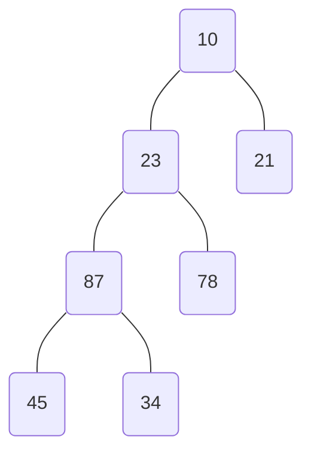

# Exercices sur les arbres

## Parcours d'arbre

### Algo préfixe, infixe, postfixe

```txt title="Structure Noeud"
type noeud = Structure
    elem : type T
    fg, fd : ↑noeud
Finstructure
```

```txt title="Parcours préfixe"
Procédure prefixe(node : ↑noeud)
    Début
        Si node != NIL faire
            afficher(↑node.elem)
            prefixe(↑node.fg)
            prefixe(↑node.fd)
        Finsi
    Fin
```

```txt title="Parcours infixe"
Procédure infixe(node : ↑noeud)
    Début
        Si node != NIL faire
            infixe(↑node.fg)
            afficher(↑node.elem)
            infixe(↑node.fd)
        Finsi
    Fin
```

```txt title="Parcours postfixe"
Procédure postfixe(node : ↑noeud)
    Début
        Si node != NIL faire
            postfixe(↑node.fg)
            postfixe(↑node.fd)
            afficher(↑node.elem)
        Finsi
    Fin
```

### Déroulé

#### Infixe

##### Arbre 1
A-B-D-G-I-C-E-F-H

##### Arbre 2
A-B-D-J-K-G-I-C-E-H-F

#### Infixe

##### Arbre 1
D-I-G-B-A-E-C-H-F

##### Arbre 2
K-J-D-G-I-B-A-C-E-H-F

#### Postfixe

##### Arbre 1
I-G-D-B-E-H-F-C-A

##### Arbre 2
K-J-I-G-D-B-H-E-F-C-A

## Nombre de noeud dans un arbre

```
Fonction nbNode(node : ↑noeud)
    Variable
        nb : entier
    Début
        Si node = NIL faire
            Retourner 0
        Sinon
            Retourner 1 + nbNode(↑node.fg) + nbNode(↑node.fd)
        Finsi
        renvoyer nb
    Fin
```

## Ajout dans un arbre

```
Fonction ajout(node : ↑noeud, v : T) -> ↑noeud
    Début
        Si node = NIL faire
            node <- allouer(noeud)
            ↑node.elt <- v
            ↑node.fg <- NIL
            ↑node.fd <- NIL
        Sinon
            Si ↑node.elt > v faire
                ↑node.fg <- ajout(↑node.fg, v)
            Sinon
                ↑node.fd <- ajout(↑node.fd, v)
            Finsi
        Finsi
        Renvoyer node
    Fin
```

## Recherche dans un arbre

```
Fonction RechercheABR(node : ↑noeud, v : T) -> booléen
    Variable
        found : booléen
    Début
        found <- Faux
        Si node != NIL faire
            Si ↑node.elt < v faire
                found <- RechercheABR(↑node.fd, v)
            Sinon si ↑node.elt > v faire 
                found <- RechercheABR(↑node.fg, v)
            Sinon
                found <- Vrai
            Finsi
        Finsi
        Renvoyer found
    Fin
```

## Analyse d'un code faux

Insertion dans l'ordre : 10, 23, 21, 87, 78, 45, 34


            