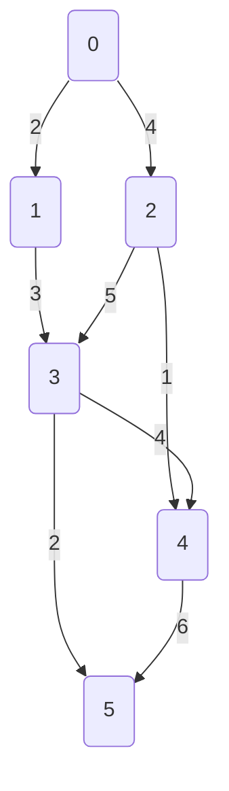

# Fonctions sur les tableaux

## Echanger deux éléments dans un tableau

```
Fonction echangerIndice(tab : Tableau[0...n-1] réels, i : entier, j : entier)
    Precondition
        i < n
        j < m
    Variable
        swp : reel
    Debut
        swp <- tab[i]
        tab[i] <- tab[j]
        tab[j] <- swp
    Fin
```

## Inserer un élément

```
Fonction insertElt(tab: Tableau[0..n-1] reel, n : entier, elt : reel, pos : entier) : Tableau[0..n] de reel
    Variable
        nTab : Tableau[0..n]
        i : entier
    Debut
        Pour i de 0 à pos -1 par pas de 1 faire
            nTab[i] <- tab[i]
        FinTantque
        nTab[pos] <- elt
        Pour i de pos+1 à n faire
            nTab[pos] <- tab[pos-1]
        FinPour
        renvoyer nTab
    Fin            
```

## Supprimer un élément en position $i$

```
Fonction supprimerElt(tab : Tableau[0..n-1], n : entier, pos : entier) : Tableau[0..n-2]
    Precondition: 
        pos < n
    Variable
        i : entier
        res : Tableau[0..n-2]
    Debut
        i <- 0
        Pour i allant de 0 à pos-1 par pas de 1 faire
            res[i] = tab[i]
        Finpour
        Pour i allant de pos+1 à n-1 par pas de 1 faire
            res[i-1] = tab[i]
        Finpour
        renvoyer res
    Fin
Finfonction
```

## Le minimum

### En renvoyant la valeur

```
Fonction minTableau(tab : Tableau[0...n-1] : réel, n : entier) : réel
    Variable
        indMin : entier
        i : entier
    Début
        indMin <- 0
        Pour i de 1 à n-1 par pas de 1 faire
            Si tab[i] < tab[indMin] faire
                indMin <- i
            Finsi
        Finpour
        renvoyer tab[indMin]
    Fin
```

<details>
    <summary>Implémentation en C</summary>
    <div>

```c
double minTableau(double* tab, int n)
{
    int indMin = 0;
    for (int i = 1; i < n; i++)
    {
        if (tab[i] < tab[indMin])
        {
            indMin = i;
        }
    }
    return tab[indMin];
}
```
    </div>
</details>

### En renvoyant l'indice

```
Fonction indMinTableau(tab : Tableau[0...n-1] : réel, n : entier) : réel
    Variable
        indMin : entier
        i : entier
    Début
        indMin <- 0
        Pour i de 1 à n-1 par pas de 1 faire
            Si tab[i] < tab[indMin] faire
                indMin <- i
            Finsi
        Finpour
        renvoyer indMin
    Fin
```

<details>
    <summary>Implémentation en C</summary>
    <div>

```c
double indMinTableau(double* tab, int n)
{
    int indMin = 0;
    for (int i = 1; i < n; i++)
    {
        if (tab[i] < tab[indMin])
        {
            indMin = i;
        }
    }
    return indMin;
}
```
    </div>
</details>


### En renvoyant les deux plus petites valeurs

```
Fonction minTableau(tab : Tableau[0...n-1] : réel, n : entier) : (réel, réel)
    Variable
        min1, min2 : reel
        i : entier
    Début
        min1 <- inf
        min2 <- inf
        Pour i de 0 à n-1 par pas de 1 faire
            Si tab[i] < min1 faire
                min2 <- min1
                min1 <- tab[i]
            Sinon si tab[i] < min2 faire
                min2 <- tab[i]
            Finsi
        Finpour
        renvoyer (min1, min2)
    Fin
```

### En renvoyant les $m$ plus petites valeurs

```
Fonction minTableau(tab : Tableau[0...n-1] : réel, n : entier, m : entier) : Tableau[0..m-1] réel
    Variable
        i, j : entier
        valMin : Tableau[0..m-1] réel
        max, swp: réel
    Début
        m <- 2
        valMin[0] <- tab[0]
        Pour i de 1 à n-1 par pas de 1 faire
            max <- tab[i]
            Pour j de 0 à m-2 par pas de 1 faire
                Si valMin[j] > max et valMin[j+1] < max faire
                    swp <- valMin[j]
                    valMin[j] <- max
                    max <- swp
                Finsi
            Finpour
            Si valMin[m-1] > max faire
                valMin[m-1] <- max
        Finpour
        renvoyer valMin
    Fin
```

## La moyenne 

Ecrire une fonction qui prend en paramètre un tableau d'entiers et retourne un réel qui est la moyenne des éléments du tableau

```
Fonction moyenne(tab : Tableau[0...n-1] : entier, n : entier) : reel
    Variable
        somme : entier
        i : entier
    Debut
        Pour i allant de 0 à n-1 par pas de 1 faire
            somme <- somme + tab[i]
        Finpour
        renvoyer some / n
    Fin
Finfonction
```
<details>
    <summary>Implémentation en C</summary>
    <div>

```c
double moyenne(double* tab, int n)
{
    double s = 0;
    for (int i = 0; i < n; i++)
    {
        s += tab[i];
    }
    return s / n;
}
```
    </div>
</details>

## La médianne

```
Fonction mediane(tab : Tableau[0...n-1] : entier, n : entier) : reel
    Variable
    Debut
        Si n modulo 2 = 0 faire 
            renvoyer (tab[n/2] + tab[n/2 - 1]) / 2
        Sinon renvoyer (tab[n/2])
        Finsi
    Fin
Finfonction
```

<details>
    <summary>Implémentation en C</summary>
    <div>

```c
double medianne(double* tab, int n)
{
    if (n % 2 == 0)
    {
        return (tab[n/2] + tab[n/2 -1]) / 2.;
    }
    else
    {
        return tab[n/2];
    }
}
```
    </div>
</details>

## Somme d'un tableau 2D

```
Fonction somme2D(tab : Tableau[0...n-1][0...n-1], n : entier) : entier
    Variable
        somme, i, j : entier
    Début
        somme <- 0
        Pour i de 0 à n-1 par pas de 1 faire
            Pour j de 0 à n-1 par pas de 1 faire
                somme <- somme + tab[i][j]
            Finpour
        Finpour
        Renvoyer somme
    Fin
```

## Nombre de valeurs non nulles dans un tableau 2D

```
Fonction nbNonNulle2D(tab : Tableau[0...n-1][0...n-1], n : entier) : entier
    Variable
        nbNonNulle, i, j : entier
    Début
        nbNonNulle <- 0
        Pour i de 0 à n-1 par pas de 1 faire
            Pour j de 0 à n-1 par pas de 1 faire
                Si tab[i][j] != 0 faire
                    nbNonNulle <- nbNonNulle + 1
            Finpour
        Finpour
        Renvoyer nbNonNulle
    Fin
```

## Triangle de Pascal

```
Fonction trianglePascal(n : entier) : Tableau[0...n-1][0...n-1]
    Variable
        tab : Tableau[0...n-1][0...n-1]
        i, j : entier
    Début
        Pour i de 0 à n-1 par pas de 1 faire
            tab[i][0] <- 1
            Pour j de 1 à i-1 par pas de 1 faire
                tab[i][j] <- tab[i-1][j-1] + tab[i-1][j]
            Finpour
            tab[i][i] <- 1
            Pour j de i+1 à n-1 par pas de 1 faire
                tab[i][j] <- 0
            Finpour
        Finpour
        Renvoyer tab
    Fin
```

<details>
    <summary>Implémentation en C</summary>
    <div>

**En passant un tableau en paramètre**
```c
void trianglePascal(int (*triangle)[], int n)
{
    for (int i = 0; i < n; i++)
    {
        triangle[i][0] = 1;
        for (int j = 1; j < i; j++)
        {
            triangle[i][j] = triangle[i-1][j-1] + triangle[i-1][j];
        }
        triangle[i][i] = 1;
        for (int j = i+1; j < n; j++)
        {
            triangle[i][j] = 0;
        }
    }
}
```

**En renvoyant un tableau alloué par malloc**
```c
#define offset(i, j, n) ((i)*(n) + (j))

int* trianglePascal(int n)
{
    int *tab = malloc(sizeof(int) * n * n);
    if (tab == NULL)
    {
        return NULL;
    }

    for (int i = 0; i < n; i++)
    {
        tab[offset(i, 0, n)] = 1;
        for (int j = 1; j < i; j++)
        {
            tab[offset(i, j, n)] = tab[offset(i-1, j-1, n)] + tab[offset(i-1, j, n)];
        }
        tab[offset(i, i, n)] = 1;
        for (int j = i+1; j < n; j++)
        {
            tab[offset(i, j, n)] = 0;
        }
    }
    return tab;
}
```
    </div>
</details>

## Déterminer si un mot est un palindrôme

```
Fonction palindrome(ch : chaine, n : entier) : booleen
    Variable
        estPalindrome
        i : entier
    Debut
        i <- 0
        estPalindrome <- Vrai
        Tantque i < n/2 Et estPalindrome faire
            Si ch[i] != ch[n-i-1] faire
                estPalindrome <- Faux
            Finsi
        Fintantque
        renvoyer estPalindrome
    Fin
Finfonction
```

<details>
    <summary>Implémentation en C</summary>
    <div>

```c
#include <stdbool.h>

bool palindrome(char* ch, int n)
{
    int i = 0;
    bool estPalindrome = true;
    while (estPalindrome && i < n/2)
    {
        if (ch[i] != ch[n-i-1])
        {
            estPalindrome = false;
        }
    }
    return estPalindrome;
}
```
    </div>
</details>

#### Déroulé

"kayak" = 5

| estPalindrome | $i$ | $ch[i]$ | $ch[n-i-1]$ |
|---------------|-----|---------|-------------|
|      Vrai     | $0$ |   'k'   |      'k'    |
|      Vrai     | $1$ |   'a'   |      'a'    |

## Effacer un caractère en position $i$

```
Fonction effacerChr(ch : chaine, pos : entier, n : entier) : chaine
    Precondition: 
        pos < n
    Variable
        i : entier
        res : chaine
    Debut
        i <- 0
        Pour i allant de 0 à pos-1 par pas de 1 faire
            res[i] = ch[i]
        Finpour
        Pour i allant de pos+1 à n-1 par pas de 1 faire
            res[i-1] = ch[i]
        Finpour
        renvoyer res
    Fin
Finfonction
```

<details>
    <summary>Implémentation en C</summary>
    <div>

```c
#include <assert.h>

char* effaceChr_cpy(char* ch, int pos, int n)
{
    assert(pos >= 0 && pos < n);
    char* res = malloc(sizeof(char)*n);
    if (res == NULL)
    {
        return res;
    }

    int i;
    for (i = 0; i < pos; i++) {
        res[i] = ch[i]
    }
    for (i = pos+1; i < n; i++) {
        res[i-1] = ch[i]
    }
    return res;
}
```
    </div>
</details>

## Nettoyer tout les caractères voulu d'une chaine

```
Fonction nettoie(ch : chaine, n : entier, del : chaine, m : entier) : chaine
    Variable
        i : entier
        j : entier
        indRes : entier
        res : chaine
        chrDel : booléen
    Debut
        i <- 0
        indRes <- 0
        Pour i allant de 0 à n-1 par pas de 1 faire
            chrDel <- Faux
            j <- 0
            Tantque j < m Et non chrDel faire
                Si ch[i] = del[j] faire
                    chrDel <- Vrai
                    j <- j+1
                Finsi
            Fintantque
            Si non chrDel faire
                res[indRes] <- ch[i]
            Finsi
        Fintantque
        renvoyer res
    Fin
Finfonction
```

## Recherche position d'insertion

```
Fonction indElt(tab: Tableau[0..n-1] réel, n : entier, elt : réel) : entier
    Precondition
        On suppose que le tableau tab est trié
    Valeur
        a, b, c : entier
        nonTrouve : booléen
    Debut
        a <- 0
        b < n-1
        nonTrouve <- Vrai
        Tantque nonTrouve b-a >= 0 faire
            c = (b-a)/2 + a
            Si tab[c] > elt faire
                b <- c
            Sinon si tab[c] < elt faire
                a <- c
            Sinon
                nonTrouve <- Faux
                c <-c+1
                Tantque c < n et tab[c] = elt faire
                    c <- c+1
                Fintantque
            Finsi
        Fintantque
        renvoyer c
    Fin
```

Avec cette fonction et la fonction insérer ont peut construire une fonction de tri

## Vérifier si un tableau est trié

```
Fonction estTrié(tab : Tableau[0..n-1], n : entier) : booleen
    Variable
        trie : booleen
        i : entier
    Debut
        Tantque trie et i < n-1 faire
            Si tab[i] > tab[i+1] faire
                trie <- Faux
            Fintantque
            i <- i+1
        Fintantque
        renvoyer trie
```

## Flouter/Lisser une image


```
Fonction filtreMoyenne(img : Tableau[0...n-1][0..m-1] entiers, n, m : entier, w : entier) : Tableau[0..n-1][0...m-1] entiers
    Variable
        img_s : Tableau[0...n-1][0...m-1]
        moy : entier
        lleft, lright, ltop, lbottom : entier
    Début
        Pour i de 0 à n-1 par pas de 1 faire
            Pour j de 0 à m-1 par pas de 1 faire

                Si i < w faire 
                    ltop <- 0 
                Sinon 
                    ltop <- i-w
                Finsi

                Si i > n-w-1 faire 
                    lbottom <- n-1 
                Sinon
                    lbottom <- i+w
                Finsi

                Si j < w faire 
                    lleft <- 0 
                Sinon 
                    lleft <- i-w
                Finsi

                Si j > m-w-1 faire 
                    lright <- n-1 
                Sinon
                    lright <- i+w
                Finsi

                moy <- 0
                Pour k de ltop à lbottom par pas de 1 faire
                    Pour l de lleft à lright par pas de 1 faire
                        moy <- moy + img[k][l]
                    Finpour
                Finpour
                img_s[i][j] <- ⌈moy / (2*w+1)²⌉
            Finpour
        Finpour
        Renvoyer img_s
    Fin
```

<details>
    <summary>Implémentation en C</summary>
    <div>

```c
#define POW2(x) ((x)*(x))

void filtreMoyenne(int (*img)[], const int (*img_src)[], int n, int m, int w)
{
    for (int i = 0; i < n-1; i++)
    {
        for (int j = 0; j < m-1; j++)
        {
            int ltop, lbottom, lleft, lright;
            int moy = 0;
            
            if (i < w) ltop = 0;
            else ltop = i-w;

            if (i > n-w-1) lbottom = n-1;
            else lbottom = i+w;

            if (j < w) lleft = 0;
            else lleft = i-w;

            if (j > m-w-1) lright = m-1;
            else lright = i+w;

            for (int k = ltop; k <= lbottom; k++)
            {
                for (int l = lleft; l <= lright; l++)
                {
                    moy += img_src[k][l];
                }
            }
            img[i][j] = moy / POW2(2*w+1);
        }
    }    
}
```

    </div>
</details>


## Graphe par matrice d'adjacence



### Matrice d'adjacence
|   |   $0$  |   $1$  |   $2$  |   $3$  |   $4$  |   $5$  |
|---|--------|--------|--------|--------|--------|--------|
|$0$|$\infty$|   $2$  |   $4$  |$\infty$|$\infty$|$\infty$|
|$1$|$\infty$|$\infty$|$\infty$|   $3$  |$\infty$|$\infty$|
|$2$|$\infty$|$\infty$|$\infty$|   $5$  |   $1$  |$\infty$|
|$3$|$\infty$|$\infty$|$\infty$|$\infty$|   $4$  |   $2$  |
|$4$|$\infty$|$\infty$|$\infty$|$\infty$|$\infty$|   $6$  |
|$5$|$\infty$|$\infty$|$\infty$|$\infty$|$\infty$|$\infty$|


### Liste des succeseurs

```
Fonction listeSucc(G : tableau[0...n-1][0..n-1] : entiers, n, i : entiers) : tableau[0...n-1] : entier, entier
    Variable
        suc : Tableau[0...n-1] d'arc
        nb : entier
        j : entier
        a : arc
    Début
        nb <- 0
        Pour j allant de 0 à n-1 par pas de 1 faire
            Si G[i][j] != ∞ faire
                a.succeseur <- j
                a.longeur <- G[i][j]
                suc[nb] <- a
                nb <- +1
            Finsi
        Finpour
        Renvoyer suc, nb
    Fin
```
Complexité : $\mathcal{O}(n)$

### Liste des prédeceseurs
```
Fonction listePred(G : tableau[0...n-1][0..n-1] : entiers, n, i : entiers) : tableau[0...n-1] : entier, entier
    Variable
        pre : Tableau[0...n-1]
        nb : entier
        j : entier
        a : arc
    Début
        nb <- 0
        Pour j allant de 0 à n-1 par pas de 1 faire
            Si G[j][i] != ∞ faire
                a.predeceseur <- j
                a.longeur <- G[i][j]
                pre[nb] <- a
                nb <- +1
            Finsi
        Finpour
        Renvoyer pre, nb
    Fin
```
Complexité : $\mathcal{O}(n)$

### Liste des succeseurs de successeurs

```
Fonction listeSuccSucc(G : tableau[0...n-1][0..n-1] : entiers, n, i : entiers) : tableau[0...n-1] : entier, entier
    Variable
        suc : Tableau[0...n-1] d'arc
        nb : entier
        nbf : entier
        j, k, l : entier
        longeur : entier
        dbl : booleen
        a : arc
    Début
        suc, nb <- listeSucc(G, n, i)
        nbf <- nb
        Pour k allant de 0 à nb par pas de 1 faire
            Pour j allant de 0 à n-1 par pas de 1 faire
                Si j != i et G[suc[k].succeseur][j] != ∞ faire
                    dbl <- Faux
                    longeur <- G[suc[k].succeseur][j] + suc[k].longeur
                    Tantque l < nbf et non dbl faire
                        Si suc[l].succeseur = j et suc[l].longeur > longeur faire
                            suc[l].longeur <- longeur
                            dbl <- Vrai
                        Finsi
                    Fintantque

                    Si non dbl faire
                        a.succeseur <- j
                        a.longeur <- G[suc[k].succeseur][j] + suc[k].longeur
                        suc[nbf] <- a
                        nbf <- +1
                    Finsi
                Finsi
            Finpour
        Finpour
        Renvoyer suc, nbf
    Fin
```
Complexité : $\mathcal{O}(n^3)$

### Determiner si un chemin existe

```
Fonction estChemin(G : tableau[0...n-1][0..m-1] : entiers, n, m : entiers, ch : Tableau[0...p-1], p : entier) : booléen
    Variable
        estChemin : booleen
        i : entier
    Début
        estChemin <- Vrai
        i <- 0
        Tantque estChemin et i < p-1 faire
            Si G[ch[i]][ch[i+1]] = ∞ faire
                estChemin <- Faux
            Finsi
            i <- i+1
        Fintantque
    Fin
```

Complexité : $\mathcal{O}(p)$

### Coût d'un chemin

```
Fonction coutChemin(G : tableau[0...n-1][0..n-1] : entiers, n : entiers, ch : Tableau[0...p-1], p : entier) : booléen
    Variable
        cout : entier
        i : entier
    Début
        Pour i de 0 à p-1 faire
            cout <- cout + G[ch[i]][ch[i+1]]
        Fintantque
    Fin
```

Complexité : $\mathcal{O}(p)$

### Savoir si un sommet est descendant d'un autre


```txt title="Fonction qui détermine si un sommet est prédécesseur"
Fonction estDescendant(G : tableau[0...n-1][0..n-1] : entiers, n : entiers, ori, dest : entier) : booléen
    Variable
        vu : Tableau[0...n-1] booleen
        i : entier
    Début
        Pour i de 0 à n-1 faire
            vu[i] <- Faux
        Finpour

        vu[ori] <- Vrai 

        renvoyer descendant(G, n, ori, dest, @vu)

    Fin
```

```txt title="Fonction recursive du parcourt en profondeur"
Fonction descendant(G : tableau[0...n-1][0..n-1] : entiers, n : entier, ori, dest : entiers, vu : ↑Tableau[0...n-1]) : booleen
    Variable
        pred : Tableau[0...n-1]
        nbPred : Tableau[0...n-1]
        trouve : booleen
        i : entier
    Debut
        trouve <- Faux
        pred, nbPred <- listePred(G, n, ori)
        i <- 0

        Tantque non trouve et i < nbPred faire
            Si i = dest faire
                trouve <- Vrai
            Sinon si non ↑vu[i] faire
                ↑vu[i] <- Vrai
                trouve <- descendant(G, n, i, dest, vu)
            Finsi 
            i <- i+1
        Fintantque

        renvoyer trouve
    Fin
```
        
Complexité : $\mathcal{O}(n^2)$

## Problème du Sudoku

### Vérification des contraintes sur les lignes

```
fonction ligne(Grille  : Tableau[0...8][0...8] d'entiers, l : entier) : booléen
    Post Condiiton
        Vrai si sur la ligne l la contrainte est vérifié
    Variable
        vu : Tableau[0...8]
        i : entier
        contrainte : booléen
        elt : entier
    Début
        Pour i de 0 à 8 faire
            vu[i] <- Faux
        Finpour

        contraite <- Vrai
        i <- 0
        Tantque contrainte Et i < 9 faire
            elt <- Grille[l][i]
            Si elt != -1 faire
                Si non vu[elt] faire
                    vu[elt] <- Vrai
                Sinon
                    contrainte <- Faux
                Finsi
            Finsi
            i <- i+1
        Fintantque
        renvoyer contrainte
    Fin
```


### Vérification des contraintes sur les colonnes

```
fonction colonne(Grille  : Tableau[0...8][0...8] d'entiers, c : entier) : booléen
    Post Condiiton
        Vrai si sur la colonne c la contrainte est vérifié
    Variable
        vu : Tableau[0...8]
        i : entier
        contrainte : booléen
        elt : entier
    Début
        Pour i de 0 à 8 faire
            vu[i] <- Faux
        Finpour

        contraite <- Vrai
        i <- 0
        Tantque contrainte Et i < 9 faire
            elt <- Grille[i][c]
            Si elt != -1 faire
                Si non vu[elt] faire
                    vu[elt] <- Vrai
                Sinon
                    contrainte <- Faux
                Finsi
            Finsi
            i <- i+1
        Fintantque
        renvoyer contrainte
    Fin
```

### Vérification des contraintes sur le carré

```
fonction carré(Grille  : Tableau[0...8][0...8] d'entiers, indX, indY : entier) : booléen
    Variable
        vu : Tableau[0...8]
        i, j : entier
        contrainte : booléen
    Début
        Pour i de 0 à 8 faire
            vu[i] <- Faux
        Finpour

        contraite <- Vrai
        i <- indY*3
        Tantque contrainte Et i < indY*3+3 faire
            j <- indX*3
            Tantque contrainte Et j < indX*3+3 faire
                elt <- Grille[i][j]
                Si Grille[i][j] != -1 faire
                    Si non vu[elt] faire
                        vu[elt] <- Vrai
                    Sinon
                        contrainte <- Faux
                    Finsi
                Finsi
                j <- j+1
            Fintantque
            i <- i+1
        Fintantque
        renvoyer contrainte
    Fin
```

### Proposition d'un coup à jouer

```
fonction proposition(Grille : Tableau[0..8][0..8], x, y : entier) : Tableau[0..8], entier
    Variable
        vu : Tableau[0..8] booléen
        res : Tableau[0..8]
        nbRes : entier
        i, j, k : entier
        cX, cY : entier
        carElt, ligElt, colElt : entier
    Début
        Pour i de 0 à 8 faire
            vu[i] <- Faux
        Finpour

        cX <- x / 3
        cY <- y / 3
        i <- 0
        Tantque i < 3 faire
            j <- 0s
            Tantque j < 3 faire
                k <- 3 * i + j

                carElt <- Grille[3*cy + i][3*cx + j]
                ligElt <- Grille[y][k]
                colElt <- Grille[k][x]

                Si carElt != -1 et non vu[carElt] faire
                    vu[carElt] <- Vrai
                Sinonsi ligElt != -1 et non vu[ligElt] faire
                    vu[ligElt] <- Vrai
                Sinonsi colElt != -1 et non vu[colElt] faire
                    vu[colElt] <- Vrai
                Finsi

                j <- j+1
            Fintantque
            i <- i+1
        Fintantque

        nbRes <- 0

        Pour i de 0 à 8 faire
            Si vu[i] faire
                res[nbRes] <- i
                nbRes <- nbRes + 1
            Finsi
        Finpour

        renvoyer res, nbRes
    Fin
```