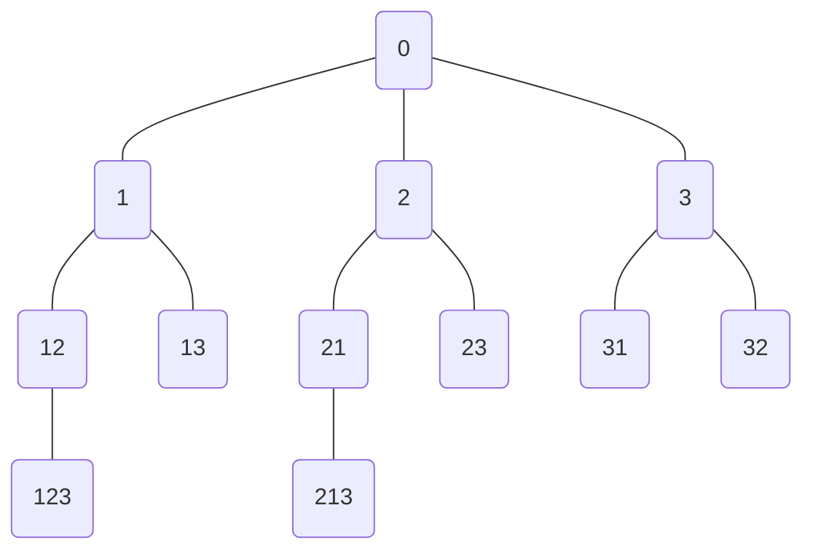
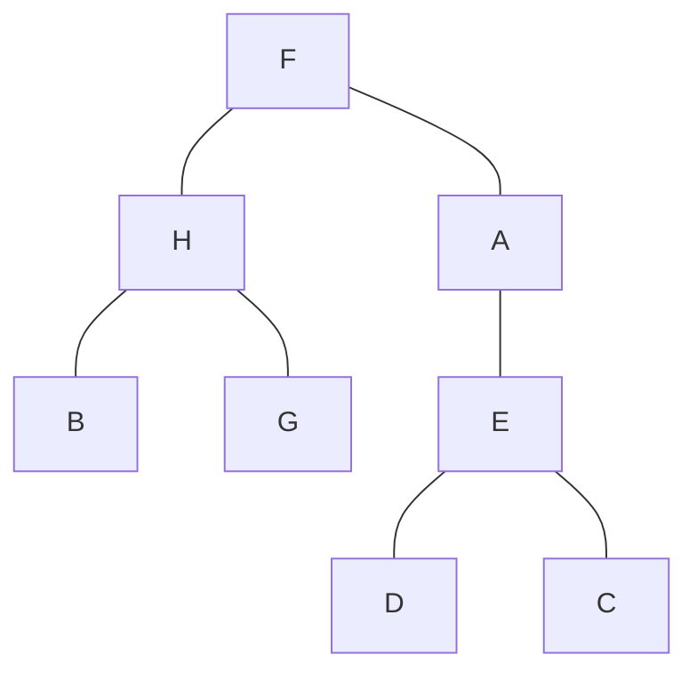
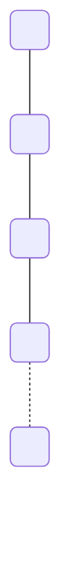
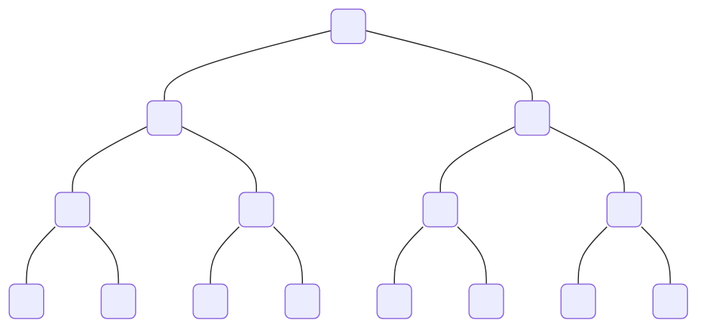
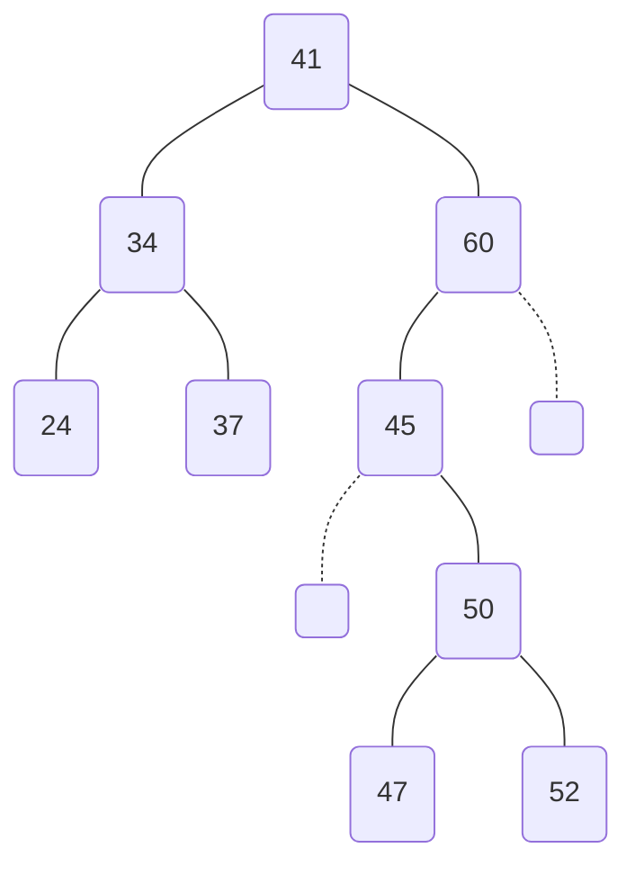
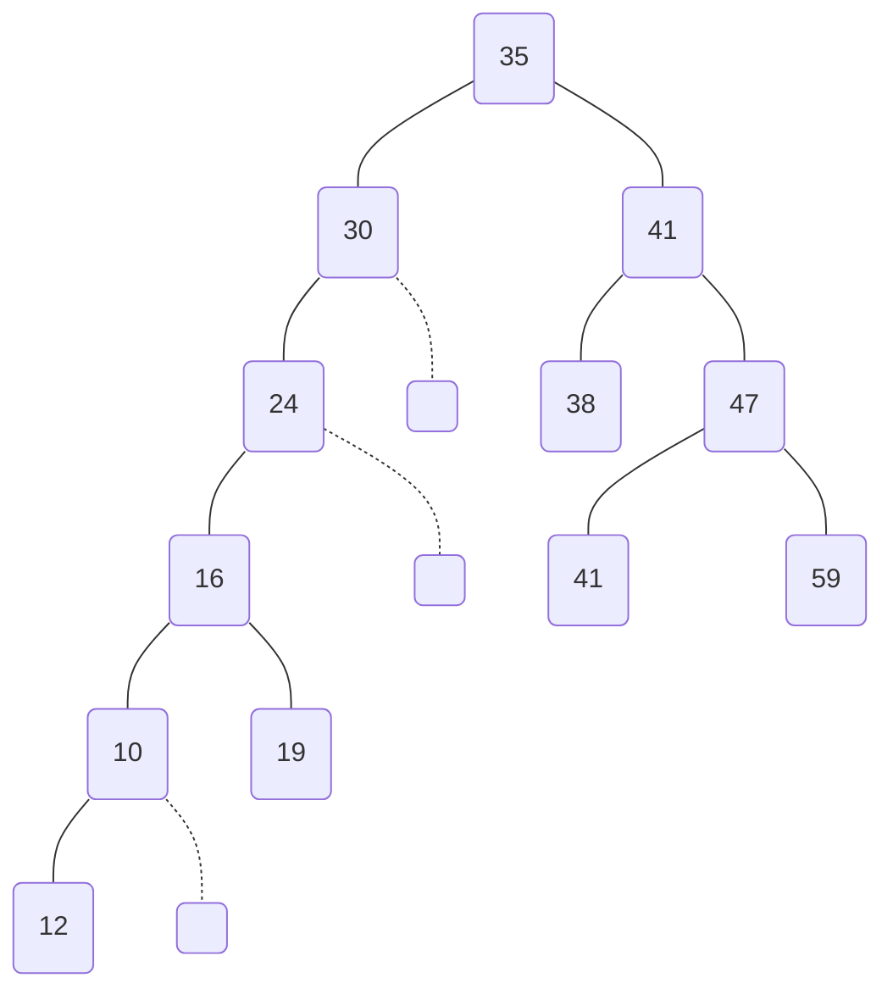
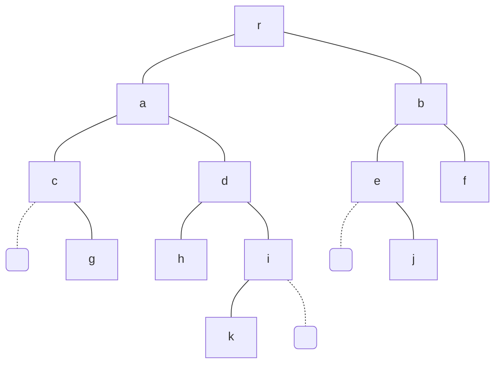

# Chapitre 4 : Arbres

## Exemple



arbre de décision, de classification, ...

## Définitions

Un arbre est une structure de données qui généralise la liste.

Dans une liste, un élément a au plus un successeur, dans un arbre il faut en avoir plusieurs.

On parle de "noeud père" et de "noeud fils". L'ancètre commun à tous les noeuds est la racine de l'arbre.
Une feuille est un noeud qui n'a pas de fils.

$A$ est un arbre binaire s'il est l'arbre vide ou bien s'il est composé d'un sommet racine $r_A$ et de deux arbres binaires, sous arbre gauche et droit de $r_A$ notés $A_g(r_A)$ et $A_d(r_A)$.

Pour tout arbre binaire $A$ et tout sommet $x$ de $A$, on note
* $A(x)$ le sous-arbre de racine $x$
* $Pere(x)$ le père du sommet $x$
* $f_g(x)$ et $f_d(x)$ le fils gauche et le fils droit de $x$

On note $h(A)$ la hauteur de l'arbre $A$

$ \displaystyle
h(A) = 
\begin{cases}
    0 & \textnormal{si}\ A\ \textnormal{est vide} \\
    1 + \max{\left( h\left(A_g(r_A) \right), h\left(A_d(r_A) \right) \right)} & \textnormal{sinon} \\
\end{cases}
$

<u>**Exemple**</u>


<u>**Déclaration**</u>
```
type noeud : Structure
    nom : chaine
    filsg, filsd : ↑noeud
```

**Un Parcourt d'arbre** est une énumération de sommets de l'arbre.
Chaque parcours délimite un ordre sur les sommets, déterminé par leur ordre d'apparition dans l'énumérations 

:::info[Propriété]
Si $A$ est un arbre binaire comptant $n$ noeuds et de profondeur $p$, alors 

$\log{n} \le p \le n-1$

au pire


au mieux 


:::

## Arbres Binaires de Recherche

### Définition

Un ABR est un arbre binaire dans lequel chaue noeud possède une clé C telle que
* Chaque noeud du sous-arbre gauche a une clé inférieur ou égale à C et chaque noeurd du sous-arbre droit à une clé supérieur ou égale à C

<u>Ex :</u>


Un ABR est **complet** si tous ses niveaux sont remplis sauf éventuellement le dernier.

Un ABR complet y compris au dernier niveau est dit **parfait**.

<u>**Exemple :**</u>

Ranger les éléments de ce vecteur dans un ABR

19, 10, 12, 41, 38, 35, 30, 59, 24, 16, 47, 41



### Parcours d'arbre binaire

On distingue 3 parcours en profondeur d'arbre



#### Ordre préfixe

On parcourt à gauche d'abord et on liste la 1ière fois qu'on voit le noeud

r, a, c, g, d, h, i, k, b, e, j, f

```
Fonction parcourt_Préfixe(T: arbre, r : sommet)
    Début
        afficher(r)
        Parcourt_Préfixe(sous-arbre gauche, fils gauche)
        Parcourt_Préfixe(sous-arbre droit, fils droit)
    Fin
```

#### Ordre postfixe

On parcourt à gauche d'abord et on liste le noeud quand on n'y revient plus

g, c, h, k, i, d, a, j, e, f, b, r

```
Fonction parcourt_Postfixe(T: arbre, r : sommet)
    Début
        Parcourt_Postfixe(sous-arbre gauche, fils gauche)
        Parcourt_Postfixe(sous-arbre droit, fils droit)
        afficher(r)
    Fin
```

#### Ordre infixe

On parcourt à gauche d'abord
et on liste un sommet qui a un fils gauche la 2ième fois qu'on le voit / sans fils la 1ier fois

c, g, a, h, d, k, i, r, j, e, b, f

```
Fonction parcourt_Infixe(T: arbre, r : sommet)
    Début
        Parcourt_Infixe(sous-arbre gauche, fils gauche)
        afficher(r)
        Parcourt_Infixe(sous-arbre droit, fils droit)
    Fin
```

#### Parcours en largeur

Pour un parcours en largeur d'abord on utilise une file en partant du sommet racine.

```txt title="Algorithme Principale"
Variable
    n : entier
    T : tableau[0...n-1] entiers
    ptrDeb, ptrNew : ↑maillon
Début
    n <- lire()
    T <- lire()
    ptrDeb <- allouer(maillon)
    ↑ptrDeb.cle <- 0
    ↑ptrDeb.filsg <- Nil
    ↑ptrDeb.filsd <- Nil
    Pour i de 0 à n-1 faire
        ptrNew <- allouer(maillon)
        ↑ptrNew.cle <- T[i]
        inserer(ptrDeb, ptrNew)
    Finpour
Fin
```