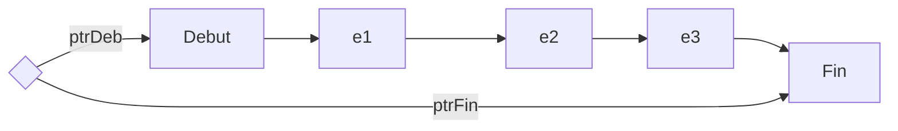
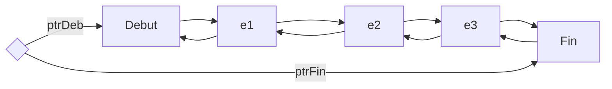

# Chapitre 3 : Pointeurs, Listes, Piles, Files

## Pointeurs
### Définitions

Toutes variable est stockée en mémoire centrale. La mémoire est un tableau où chaque élément est identifié par une adresse.
Pour trouver une valeur, il faut donc connaître son adresse en mémoire. C'est le compilateur qui fait le lien entre les variables et leurs valeurs en mémoire.
Pour accéder à la valeur d'une variable on utilise son nom. On peut aussi passer par son adresse, donc un pointeur.

Un pointeur est une variable qui contient l'adresse d'une autre variable;

Un pointeur permet d'accéder à la valeur d'une variable sans la nommer

type mon_ptr : $\uparrow$entier $\leftarrow$ type de l'objet pointé

### Initialisation

On peut initialiser une variable de type pointeur de 3 façons:
* Avec la constante NIL
* Avec l'adresse d'une donnée existante
* Par une allocation dynamique

:::warning
On ne laisse jamais une variable pointeur sans initialisation
:::

#### Avec NIL


$\textnormal{mon\_ptr} \leftarrow \textnormal{NIL}$

#### Avec des données

On utilise l'opérateur @ pour accéder à l'adresse mémoire

<u>**Exemple:**</u>

<u>Variables:</u> <br/>
&emsp; toto : entier <br/>
&emsp; mon_ptr : $\uparrow$entier <br/>
&emsp; titi : entier <br/>
<u>Début</u> <br/>
&emsp; toto $\leftarrow$ 15 <br/>
&emsp; mon_ptr $\leftarrow$ @toto <br/>
&emsp; titi $\leftarrow$ ($\uparrow$mon_ptr)+2 <br/>
<u>Fin</u>

#### Avec l'allocation dynamique

L'allocation dynamique est la réservation d'un emplacement mémoire dans une zone dynamique. On réserve cet emplacement, on l'utilise et ensuite on la libère.

On accède aux variables par leur adresse.

On stocke les adresses des variables pas leurs noms

<u>**Exemple:**</u>

<u>Variables:</u> <br/>
&emsp; ptr_toto : $\uparrow$entier <br/>
<u>Début</u> <br/>
&emsp; ptr_toto $\leftarrow$ allouer(entier) <br/>
&emsp; $\downarrow$ <br/>
&emsp; Contient l'adresse de l'entier dans la mémoire alloué

:::warning
Allouer ne veut pas dire initialiser
:::

On libère la mémoire avec `libérer(ptr_toto)`

:::warning
* On ne peut pas libérer un pointeur qui vaut `NIL`
* On ne peut pas libérer un pointeur déjà libéré
* On ne peut accéder à une zone libéré
:::


<u>**Exemple: Passage par adresse/par valeur**</u>

Algorithme Principale
```
Variable
    i,j : entiers
    T : tableau[0..2] entiers
    res : entier
Début
    i <- 4
    j <- 58
    T[0] <- 321
    T[1] <- 437
    T[2] <- 812

    écrire(T)
    Echange(T[0], T[1])
    écrire(T)
    Echange_adr(@T[0], @T[1])
    écrire(T)
Fin
```

```
Fonction Echange(a, b : entier)
    Variable
        tmp : entier
    Début
        tmp <- a
        a <- b
        b <- tmp
    Fin
```

:::info
La fonction Echange n'agit en rien sur le programme principale, les paramètres sont passé par valeurs
:::

```
Fonction Echange_adr(adra, adrb : ↑entier)
    Variable
        tmp : entier
    Début
        tmp <- ↑adra
        ↑adra <- ↑adrb
        ↑adrb <- tmp
    Fin
```

### Arithmétique des pointeurs

* On peut ajouter/soustraire un entier à un pointeur.
* On peut calculer la différence entre deux pointeurs, on obtient un entier.
* On peut comparer deux pointeurs.

### Pointeurs vers une structure

cf : TD

## Listes chainées



* Liste simplement chainée
* Initialisation à vide
* Insertion (en tête, en fin, à la place triée)
* Suppression d'un maillon

## Piles et Files

Les Piles et les Files sont des listes où la seule qui les distingue est la façon dont les éléments sont ajoutés et retirés.

**Une Pile** est une liste en gestion **LIFO**, Last In First Out.

<u>**ex**</u><br/>
insère en fin de liste <br/>
extraire le dernier de liste

Ou encore <br/>
insère en début de liste <br/>
extraire le premier de liste

**Une File** est en gestion **FIFO**, First In First Out

<u>**ex**</u><br/>
insère en fin de liste <br/>
extraire le premier de liste

Ou bien <br/>
insère en début de liste <br/>
extraire le dernier de liste

<u>**Exemple double chaînage**</u><br/>

```
type maillon : structure
        cpt : entier
        nb : entier
        suiv : ↑maillon
        prec : ↑maillon
Finstructure
```



```
Fonction InsereFIFO(ptrDeb, ptrFin, ptrC : ↑maillon)
    Variable
        ptrS : ↑maillon
    Début
        ptrS <- ↑ptrDeb.suiv
        ↑ptrDeb.suiv <- ptrC
        ↑ptrC.suiv <- ptrS
        ↑ptrS.prec <- ptrC
        ↑ptrC.prec <- ptrDeb
    Fin
```

```
Fonction ExtraireFIFO(ptrDeb, ptrFin : ↑maillon)
    Precondition
        On suppose que la liste n'est pas vide
    Postcondition
        ptrC pointe sur le dernier maillon, qui est retiré du chaînage mais non libéré
    Variable
        ptrS, ptrC : ↑maillon
    Début
        ptrC <- ↑ptrFin.prec
        ptrS <- ↑ptrC.prec
        ↑ptrS.suiv <- ptrFin
        ↑ptrFin.prec <- ptrS

        // éventuellement
        ↑ptrC.prec <- Nil
        ↑ptrC.suiv <- Nil

    Fin
```