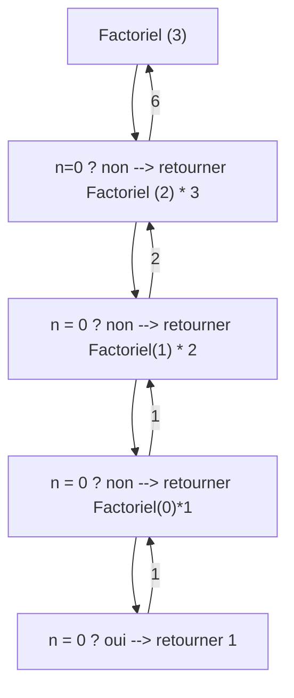

# Chapitre 1 : Introduction

## Définition et notions de base

### Définitions

:::info[Définition]
Un algorithme est la déscription d'un processus par un ensemble d'opération et de règles opératoire élémentaires, conduisant à un résultat
:::

<u>**Exemple:**</u>
* Recette de cuisine
* addition posée

:::tip[Propriétés]
* Un algorithme à un nombre fini d'étapes et d'opérations par étape, qui s'éxécutent en séquence
* Un algorithme se termine en un nombre fini d'opérations
* Un algorithme fourni toujours un résultat
* Un algorithme est indépedant de sont language de programmation
:::

Un algorithme est fait pour répondre à un besoin, à une question.
Il n'écéssite une analyse de ce besoin

Un algorithme à besoin de données en entrée et fourni un ou plusieurs résultat s en sortie.

<u>**Exemple:**</u>
* Calcul de $n!$
  - Entrée : $n$
  - Sortie : $1 \times 2 \times ... \times (n-1) \times n$
* Plus grand élément d'un ensemble
  - Entrée : tableau des éléments
  - Sortie : Le plus grand
* Calcul d'une tournée de véhicules
  - Entrée : Positions entrepôt et client distances
  - Sortie : tableau ordonné des points à visiter

Un algorithme est spécifié par :
* Un nom
* Entrées : La liste des variables en entrée
* Préconditions : Conditions que doivent vérifier des paramètres d'entrée
* Sorties : La liste des variables fournies en sortie
* Post conditions : Conditions qui vérifient les sorties

Un algorithme commence par <u>Début</u> et finit par <u>Fin</u>

### Constantes, variables, types

Une constante est un objetqui prend une valeur et dont l'état reste inchangé.

<u>**Exemple:**</u> <br/>
Constante PI = 3.14 <br/>
Constante Nom = 'toto'

Une <u>variable</u> est un objet dont le contenu peut être modifié par une acction. Une variable est d'un certain type.
  
<u>**Exemple:**</u> <br/>
* Entier
* Réel
* Logique
* Caractère
* Chaine de caractère

Les algorithmes manipulent les constantes et les variables.

### Organisation de la mémoire

On considère pour simplifier que la mémoire est une suite d'emplacement de taille élémentaire, accéssibles en lecture et écriture. Les variables peuvent prendre plus ou moins de place selon leur type.

Par convention on considèreles tailles suivantes :
* 1 case
  - Entier
  - Caractère
  - 1 booléen
* 2 cases
  - Réel
  - Adresse

<u>**Exemple:**</u>

```
Variables:
  x,y : réels
  A,B : entiers
  ch : chaîne

x <- 1.0
y <- 3.14
ch <- 'toto'
A <- 12
B <- 624
```

|     |
|-----|
| 'o' |
| 't' |
| 'o' |
| 't' |
| 624 |
|  12 |
| 3.14|
| 1.0 |

Les adresse des emplacements en mémoire des contenus des variables (nous ne décidons pas de l'emplacement physique des données en mémoire)

On déclare une variable en précisant sont type

**nom_variable : type_variable**

Déclarer une variable ne place au aucune information en mémoire. Il faut lui affecter une valeur ($\leftarrow$)

### Opérations élémentaires

On peut effectuer des opérations élémentaires sur des variables en fonction de leur type :
* Affectation $\leftarrow$
* Comparaison entre 2 variables ou 1 variable et 1 constante
  - $A \le B\ (\gt\ =)$
  - $A \lt B\ (\ge\ \neq)$
* Pour les booléens
  - Affecter à Vrai ouFaux
  - Opérateurs : ET, OU, NOT
* Pour les entiers/réels: $+\ -\ \times\ \div$

## Structure de données

Sur les types de base, on peut créer et manipuler d'autre types de données

### Tableaux

Un tableau est un ensemble d'objets de même type, indicé par un ensemble d'indices qui permettent d'accéder à chaque objet.
Les objets sont toujours contigues en mémoire. On y accède à partir de l'adresse de base du tableau et de l'indice

Un tableau peut avoir plusieurs dimensions. <br/>
Un tableau à 1 dimension est appelé un vecteur

**Type mon_tableau : Tableau$[0..n-1]$ : entiers

<u>**Exemple:**</u> <br/>
$n$ entier <br/>
Type tab : Tableau$[0..n-1]$ : entiers <br/>
Type tab_réels : Tableau$[0..n-1]$ : réels <br/>
$n \leftarrow 3$ <br/>
$tab[0] \leftarrow 12$
$tab[1] \leftarrow 24$
$tab[2] \leftarrow 47$
$tab_reels[0] \leftarrow 21.4$
$tab_reels[1] \leftarrow 3.14$
$tab_reels[2] \leftarrow 134.1$

| ||
|--- |-|
|134.1 ||
|3.14 ||
|31.4 |tab_réels|
|47 ||
|24 ||
|12 |tab|
|3 |n|

<u>**Exemple:**</u> <br/>
$n,m$ : entiers <br/>
Type mat : Tableau$[0..n-1, 0..n-1]$ : réels <br/>
$n \leftarrow 2$ <br/>
$m \leftarrow 3$ <br/>

$
\displaystyle
\begin{pmatrix}
 4.0 & 2.1 & 1.3 \\
 7.6 & 8.9 & 9.6 
\end{pmatrix}
$

mat$[0,0] \leftarrow 4.0$ <br/>
mat$[0,1] \leftarrow 2.1$

||
|---|
|9.6|
|8.9|
|7.6|
|1.3|
|2.1|
|4.0|

Dans les tableaux on cherche le plus grand (petit) élément, à inserer/supprimer un élément, à trier un tableau, etc.

### Structures générales

Une structure sert à organiser les données. Elle comporte des données de diférents types qui seront placé de façon contigue en mémoire.

On accède à un champ de la structure en utilisant '.'

```
Type mon_struct : Structure
  nom_champ1 : type1
  nom_champ2 : type2
  .
  .
  .
FinStructure
```
<u>**Exemple:**</u> <br/>
```
Type points : Structure
  coordX : réel
  coordY : réel
  nom : chaine
FinStructure
```

<u>**Exemple:**</u> <br/>
```
Variable
  nom_point : points
  .
  .
Début
  nom_pots.coordX <- 0.0
  nom_pots.coordY <- 1.0
  nom_pots.nom <- 'ici'
```

||
|---|
|'i'|
|'c'|
|'i'|
|1.0|
|0.0|

## Actions élémentaires
### Affectation

variable $\leftarrow$ valeur ou expression

Les opérations d'entrée/sortie permettent de lire et d'écrire des données.

<u>**Exemple:**</u> <br/>
```
Variable
  A : entier
  B : entier
  C : entier
Début
  A <- 10
  B <- 50
  C <- A
  A <- B
  B <- C
Fin
```

### Structure conditionnelles

```
Si condition alors
  bloc 1
sinon
  bloc 2
finsi
```
_condition : expression ou variable booléenne_

```
Si condition1 alors
  bloc 1
sinon si condition2 alors
  bloc 2
sinon
  bloc 3
finsi
```
<u>**Exemple:**</u> <br/>

```
Entrée:
  XA,YA,XB,YB,XC,YC : entiers

Sortie: 
  res : booléen

Post cond:
  res = Vrai si (A,B,C) est un triangle rectangle
  res = Faux sinon

Variables:
  AB2, AC2, BC2 : entier

Début
  AB2 <- (XA - XB)² + (YA-YB)²
  AC2 <- (XA - XC)² + (YA-YC)²
  BC2 <- (XB - XC)² + (YB-YC)²

  Si AB2 = BC2 + AC2 alors
    res <- Vrai
  Sinonsi BC2 = AC2 + AB2 alors
    res <- Vrai
  Sinonsi AC2 = AB2 + BC2 alors
    res <- Vrai
  Sinon
    res <- Faux
  Finsi
Fin
```

$res \leftarrow ((AB^2 = AC^2 + BC^2) \lor (BC^2 = AC^2 + AB^2) \lor (AC^2 = AB^2 + BC^2))$

### Structure répétitive

#### Tant que
```
tantque condition
  bloc
fintantque
```
_condition : expression ou variable booléenne_ <br/>
_bloc : répététant que la condition est vraie, donc bloc doit modifier la valeur de la condition_

#### Pour
```
pour var de depart à fin par pas faire
  bloc
finpour
```
:::danger
Ne pas modifier var
:::
$\Leftrightarrow$
```
var <- depart
tantque var <= fin faire
  bloc
  var <- var + pas
fintantque
```

<u>**Exemple:**</u> <br/>
Calculer la somme des $n$ premiers entiers au carré
$$
S = \sum_{i=1}^n i^2
$$

```
calculSomme(n : entier) : entier
Entrée:
  n : entier
Précondition :
  n >= 0
Sortie: 
  S : entier

Post condition:
```
$
\displaystyle
S = \sum_{i=1}^n i^2
$
```
Variables:
  i : entier

Debut
  S <- 0
  pour i de 1 à n faire
    S <- S + i²
  finpour
Fin
```

#### Répéter

```
repéter
  bloc
jusqu'à condition
```

<u>**Exemple:**</u> <br/>
Soit $T$ un tableau de $n$ entiers <br/>
Soit $S$ un entier <br/>
Trouver deux entiers de $T$ dont la somme fait $S$

<u>2 cas</u>
* a) $T$ non trié
* b) $T$ trié par valeur croissante

```
Entrée
  Type T ; Tableau[0..n-1] : entiers
  n : entier
  S : entier
Sortie
  A,B : entier
  exist : booléen
Post condition
```
$\exist\ i \in [0,\dots,n-1], \exist j \in [0 \dots n-1],
i \neq j, A = T[i], B = T[j]\ \textnormal{et}\ A + B = S$
```
Variables
  trouve : boolén
Début
  trouve <- Faux
  i <- 0
  Tantque i <= n-2 et non trouve faire
    j <- i+1
    Tantque j <= n-1 et non trouve faire
      Si T[i] + T[j] = S alors
        A <- T[i]
        B <- T[j]
        trouve <- vrai
      Finsi
      j <- j+1
    Fintantque
    i <- i+1
  Fintantque
Fin
```

## Fonctions, procédures
### Fonctions

Une fonction est une séquence d'instructions qui est appelée à plusieurs reprises au sein d'un programme plus global

```
Fonction nom_f (liste des paramètres avec leurs types) : type du résultat
            <-------- Avec préconditions et post conditions
  Variables
    .
    .
    .
  Début
    .
    .
    .
  Fin
```

On peut passer les paramètres par adresse ou par valeurs.
* **Par adresse** : La fonciton agit sur le contenu en mémoire, qui est modifié
* **Par valeur** : Le contenu en mémoire n'est pas modifié, le paramètre est copié temporairement puis détruit en sortant de la fonction

### Fonction récursives

Une fonction récursive est une fonction qui s'appelle elle-même

<u>**Exemple:**</u>
Calcul de $n!$

$n! = 1 \times 2 \times \dots \times (n-1) \times n$

$n! = (n-1)! \times n$

:::warning
Il faut une condition d'arrêt !
:::

pour $n!$ on dit que si $n=0$ on retourne $1$.

```
Fonction Factoriel(n : entier) : entier
  Précondition: n >= 0
  Sortie : n!
Début
  Si n = 0 alors Retrouner(1)
  Sinon Retourner (Factoriel(n-1) * n)
  Finsi
Fin
```

Une pile est utilisé pour stocker les appels en cours

<u>**Exemple:**</u>


```
Algorithme ProgrammePrincipal
...
Variables
  a, n, produit : entiers
Début
  a <- lire()
  n <- lire()
  produit <- Multiple (a,n)
  ecrire('a x n = ',produit)
Fin
```

```
Fonction Multiplie(a, n : entier) : entier
...
Variables
Début
  Si n = 1 alors
    retourner (a)
  Sinon
    retourner (a + Multiplie(a,n-1))
  Finsi
Fin
```