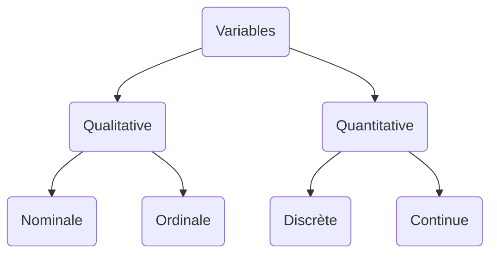

# D'autres rappels
## Intro
eg: J.O.
|    | nom | prénom | âge | taille |
|----|-----|--------|-----|--------|
| A1 |     |        |     |        |
| A2 |     |        |     |        |
| A3 |     |        |     |        |
|    |     |        |     |        |

* Vocabulaire
  - lignes = INDIVIDUS
  - Colonnes = VARIABLES

* Types de variables

* Quantitative mots, codes, ...
  - Ordinale: qu'on peut ordonner (ex: identifiant)
  - Nominale: qu'on ne peut pas ordonner (ex: plat favori)
* Quantitatives des membres
  - Continu: nb de valeurs (ex: taille, ...)
  - Discrète: nb fini (ex: mois)
---

* On a un tableau de données
* Variables $X_1, \dots, X_m$
* Quels corrélation ?
  - $Cor(X_1, X_2)$
  - $Cor(X_1, X_3)$
  - $\dots$
* Il y a $\frac{m(m-1)}{2}$ corrélations

|         | $X_1$ | $X_2$ | $\dots$ | $X_m$ |
|---------|-------|-------|---------|-------|
| $X_1$   |       |       |         |       |
| $X_2$   |       |       |         |       |
| $\dots$ |       |       |         |       |
| $X_m$   |       |       |         |       |

-> **Matrice** de corrélation

## Matrices : def & notations
$A \in \mathcal{M}_{n, p}(\mathbb{R})$

$\displaystyle
A =
\begin{pmatrix}
  a_{1,1} & \dots  & a_{1,j} & \dots & a_{1,p} \\
  \vdots  &        & \vdots  &       & \vdots  \\
  a_{i,1} & \dots  & a_{i,j} & \dots & a_{i,p} \\
  \vdots  &        & \vdots  &       & \vdots  \\
  a_{n,1} & \dots  & a_{n,j} & \dots & a_{n,p} \\
\end{pmatrix}
$

### Transosée
* $^tA \in \mathcal{M}_{p,n}(\mathbb{R})$, donné par $^t(A)_{ij} = a_{ji}$
* Propriétés
  - $^t(A-B) = ^tA - ^tB$
  - $^t(AB) = ^tA . ^tB$
  - $^(\lambda A) = \lambda ^tA, \lambda \in \mathbb{R}$.
  - $^t(^t A) = A$
  - $^t(A^{-1}) = (^t A)^{-1}

### Opération
* Addition
* Multiplication par un scalaire
* Multiplication $AB$, $A \in \mathcal{M}_{n,p}(\mathbb{R}), B \in \mathcal{M}_{p,m}(\mathbb{R})$

### Matrices particulières
Soit $A \in \mathcal{M}_{n,n}(\mathbb{R})$, matrice carré
* $A$ symétrique sa $^t A = A$
* $A$ symétrie est dite défini positive **ssi**
$\forall x \in \mathbb{R}^n, x \neq 0, ^tx A x > 0$

### Trace
* $A \in \mathcal{M}_{n,n}(\mathbb{R})$  
$\displaystyle tr(A) = \sum^n_{i=1} a_{i,i}$
* $Tr(^tA) = Tr(A)$
* Soit $\lambda \in \mathbb(R), Tr(\lambda A) = \alpha Tr(A)$
* $Tr(AB) = Tr(BA)$
* $Tr(ABC) = Tr(BCA) = Tr(CAB)$  
-> permutation circulaire

### Déterminant

* $\displaystyle
det
\begin{pmatrix}
  a & b \\
  c & d \\
\end{pmatrix} = ad - bc
$

* $\displaystyle
det
\begin{pmatrix}
  a & b & c \\
  d & e & f \\
  g & h & i \\
\end{pmatrix}
 = ?$

 * $\displaystyle det(A) = \sum^n_{i=1} a_{i,j} (-1)^{i+j} det(A_{i,j})$ pour un $i$ donné

<u>**Propriétés**</u>
* $det(AB) = det(A)det(B)$
* $det(^t A) = det(A)$
* $det(A) \neq 0 \Leftrightarrow A\ \textnormal{inversible}$

### Valeurs propres et vecteurs propres

* $A \in \mathcal{M}_{n,n}(\mathbb{R})$  
  $\lambda \in \mathbb{R}$  
  $\lambda$ valeur propre de $A$ <u>**ssi**</u> $\exist u  \neq 0 \in \mathbb{R}^n \textnormal{tq}$  
  $Au = \lambda u$  
  $u$ est alors appelé le vecteur propre associé à la valeur propre $\lambda$
* $\lambda$ valeur propre <u>**ssi**</u> $det(A-\lambda I_n) = 0$ **preuve** **TODO** !!
* $det(A-\lambda I_n)$ est le **polynome**
* $det(A-\lambda I_n)$ est le **polynome caractéristique** de $A$
* Si $A$ symétrique, alors  
$\displaystyle tr(A) = \sum^p_{n=1} \lambda_i$ (somme des valers propres de $A$)

## Notion de métrique
Variable **centrée réduite**
