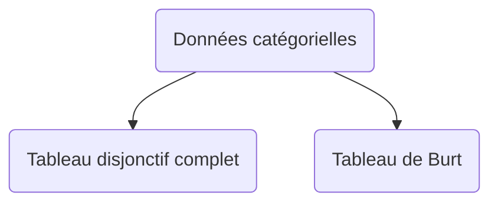

# ACM: Analyse Factorielle des Composantes Multiples

## Notations
### Les données
* Soit $p \ge 3$ **variable catégorielles**, observées sur un ensemble de $n$ individus, chacun affecté par le même poids $\frac{1}{n}$
* On note ces variables $X^1 \dots X^p$
* Le nombre de **modalités** de $X^j$ est noté $c_j$, avec $j = 1 \dots p$
* On note $\displaystyle c = \sum^p_{j=1} c_j$
  - nb total des modalités considérées, toutes variables confondues

### Tbaleau disjonctif complet

|          | $X^1$         |  $X^2$        | $\dots$ |  $X^p$        |
|----------|---------------|---------------|---------|---------------|
|          | $1 \dots c_1$ | $1 \dots c_2$ | $\dots$ | $1 \dots c_p$ |
| $e_1$    |               |               |         |               |
| $\vdots$ |               |               |         |               |
| $e_n$    |               |               |         |               |

$\rightarrow$ tableau “binaire” que des 0 ou 1 !

### Tableau de Burt

* $\in \mathcal{M}_c (\mathbb{N})$
* Constitué de $p^2$ sous matrice
* chaque p sous-matrices diagonalisé est relative à 1 var $X^j$
* la j-ième est carré, d'ordre $c_j$, diagonale et comporte sur la diagonale les effectifs marginaux de $X^j$
* Une sous-matrice $(j, j')_{j \neq j'}$ est la **table de contingence** associé à $(X^j, x^{j'})$
* Matrice **symétrique**
* On a $B = Z^\top Z$

### Illustration (Burt)
* Soit 797 étudiants ayant leur M2 sur une certaine période
* On considère les attributs suivants
  - **Série de bac**: bac L, bac S
  - **âge obtention bac**: $\lt 18, 18, 19, \gt 19$
  - **durée obtention M2**: $5, 6 \textnormal{ ou } 7 \textnormal{ ans}$

|          | Bac L    | Bac S    |   | $\lt 18$ | $18$     | $19$     | $\gt 19$ |   | $5$      | $6$      | $7$      |
|----------|----------|----------|---|----------|----------|----------|----------|---|----------|----------|----------|
| Bac L    | $\times$ | $O$      |   | $\times$ | $\times$ | $\times$ | $\times$ |   | $\times$ | $\times$ | $\times$ |
| Bac S    | $O$      | $\times$ |   | $\times$ | $\times$ | $\times$ | $\times$ |   | $\times$ | $\times$ | $\times$ |
|          |          |          |   |          |          |          |          |   |          |          |          |
| $\lt 18$ | $\times$ | $\times$ |   | $\times$ | $O$      | $O$      | $O$      |   | $\times$ | $\times$ | $\times$ |
| $18$     | $\times$ | $\times$ |   | $O$      | $\times$ | $O$      | $O$      |   | $\times$ | $\times$ | $\times$ |
| $19$     | $\times$ | $\times$ |   | $O$      | $O$      | $\times$ | $O$      |   | $\times$ | $\times$ | $\times$ |
| $\gt 19$ | $\times$ | $\times$ |   | $O$      | $O$      | $O$      | $\times$ |   | $\times$ | $\times$ | $\times$ |
|          |          |          |   |          |          |          |          |   |          |          |          |
| $5$      | $\times$ | $\times$ |   | $\times$ | $\times$ | $\times$ | $\times$ |   | $\times$ | $O$      | $O$      |
| $6$      | $\times$ | $\times$ |   | $\times$ | $\times$ | $\times$ | $\times$ |   | $O$      | $\times$ | $O$      |
| $7$      | $\times$ | $\times$ |   | $\times$ | $\times$ | $\times$ | $\times$ |   | $O$      | $O$      | $\times$ |

## Principes généraux de l'$ACM$ (no math include)

* Cette méthodevise à mettre en évidence
  - les relations entre les modalités de différentes variables.
  - les relations entre les individus (ressemblance, proximité).
  - les relations entre les variables.

* En réalité, souvent les liaisons de variable 2 à 2 ...
$\rightarrow$ $AFCB !$

* La suite de l'analyse peut se faire sur l'un ou l'autre des tableaux
* On a alors des résultats analogues mais pas identiques !
* En général, on fait l'$AFCB$ sur le tableau de Burt
  (axes, coordonnées, cosinus$^2$, contributions).
* L'interprétation se fait en $AFCB$ **MAIS** certains indicateurs ne sont pertinents/valables !
$\rightarrow$ cela sous-entend une bonne maîtrise de l'$AFCB$

## Exemple illustratif
