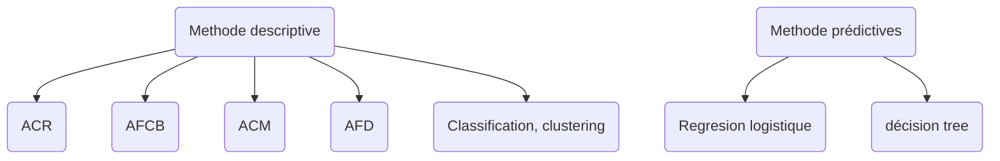

# Introduction au méthode de l'analyse de données

## Introduction

- $\exist \neq \textnormal{categorie de méthode de l'AD}$

* **Nous**
 - Déscriptif only
 - Méthode exploratoire
 - Absence d'hypothèse à priori sur les données
* **Méthode abordées**
  - ACP : Analyse en composant principale
  - AFCB : Analyse Factorielle des Composantes Binaires
  - ACM : Analyse Factorielle des Composantes Multiples
  - AFD : Analyse Factorielle Discriminante
  - clustering : kmeans, CAH (Classif Ascendante Hiérachique)

### Analyse Multidimensionnelle

|       | taille ($m$) | poids ($kg$) | âge |
|-------|--------------|--------------|-----|
| $e_1$ |              |              |     |
| $e_2$ |              |              |     |

Schéma **II.1**

### Généralisation

$n$ individus, décris par $p$ variables

|          | $X_1$ | $X_2$ | $\dots$ | $X_p$ |
|----------|-------|-------|---------|-------|
| $e_1$    |       |       |         |       |
| $e_2$    |       |       |         |       |
| $\vdots$ |       |       |         |       |
| $e_n$    |       |       |         |       |

On cherche des **FACTEURS** (variables dérivées) permettant de résumer (les caractéristiques) des données

On introduit la notion **d'analyse factorielle** dont les objéctifs sont de :
*  
  - Mettre en évidance des relations entre groupe de variable [**ANALYSER**]
  - Permettre une éventuelle visualisation **informatique** [**VISUALISER**]
*  
  - Réduite la **redondance** présentes dansles variables vitales (eg. poids, taille, IMC, ...) [**DÉCORRELER**]
  - Choisir un $\textnormal{sous-espace}$ de variables “plus pertinant” [**RÉDUIRE**]
