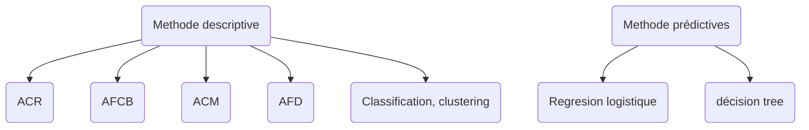

# Introduction au méthode de l'analyse de données

## Introduction

- $\exist \neq \textnormal{categorie de méthode de l'AD}$

* **Nous**
 - Déscriptif only
 - Méthode exploratoire
 - Absence d'hypothèse à priori sur les données
* **Méthode abordées**
  - ACP : Analyse en composant principale
  - AFCB : Analyse Factorielle des Composantes Binaires
  - ACM : Analyse Factorielle des Composantes Multiples
  - AFD : Analyse Factorielle Discriminante
  - clustering : kmeans, CAH (Classif Ascendante Hiérachique)

### Analyse Multidimensionnelle

|       | taille ($m$) | poids ($kg$) | âge |
|-------|--------------|--------------|-----|
| $e_1$ |              |              |     |
| $e_2$ |              |              |     |

Schéma **II.1**

### Généralisation

$n$ individus, décris par $p$ variables

|          | $X_1$ | $X_2$ | $\dots$ | $X_p$ |
|----------|-------|-------|---------|-------|
| $e_1$    |       |       |         |       |
| $e_2$    |       |       |         |       |
| $\vdots$ |       |       |         |       |
| $e_n$    |       |       |         |       |

On cherche des **FACTEURS** (variables dérivées) permettant de résumer (les caractéristiques) des données

On introduit la notion **d'analyse factorielle** dont les objéctifs sont de :
*  
  - Mettre en évidance des relations entre groupe de variable [**ANALYSER**]
  - Permettre une éventuelle visualisation **informatique** [**VISUALISER**]
*  
  - Réduite la **redondance** présentes dansles variables vitales (eg. poids, taille, IMC, ...) [**DÉCORRELER**]
  - Choisir un $\textnormal{sous-espace}$ de variables “plus pertinant” [**RÉDUIRE**]

## ACP

### Éxemple illustratif
On considère les notes $\in [0, 20]$ obtenus par $9$ élèves dans $4$ matières

Maths ($M$), Physique($P$), Anglais($A$) et français($F$)

|          |  $M$  |  $P$  |  $A$  |  $F$  |
|----------|-------|-------|-------|-------|
| $e_1$    |  $6$  |  $6$  |  $5$  | $5,5$ |
| $e_2$    |  $8$  |  $8$  |  $8$  |  $8$  |
| $e_3$    |  $6$  |  $7$  |  $11$ | $9,5$ |
| $e_4$    | $14,5$| $14,5$| $15,5$| $15$  |
| $e_5$    |  $14$ |  $14$ | $12$  | $12,5$|
| $e_6$    |  $11$ |  $10$ | $5,5$ |  $7$  |
| $e_7$    | $5,5$ |  $7$  |  $14$ | $11,5$|
| $e_8$    |  $13$ | $12,5$| $8,5$ | $9,5$ |
| $e_9$    |   $9$ | $9,5$ | $12,5$| $12$  |

**Objectif**: Analyse simultanée sur nos 4 matières

Sur une variable donnéeque faire (analyse mono-variables)

|     |  mean  |  std   |   min   |  max   |
|-----|--------|--------|---------|--------|
| $M$ | $8,67$ | $3,77$ |  $5,5$  | $14,5$ |
| $P$ | $9,83$ | $2,99$ |    $6$  | $14,5$ |
| $F$ | $10,22$| $3,47$ |    $5$  | $15,5$ |
| $A$ | $10,06$| $2,81$ |  $5,5$  |  $15$  |

Covariance : $cov(X, Y) = E\left((X-E(X)) \cdot (Y - E(Y))\right)$

Corélation : $\displaystyle correl(X, Y) = \frac{cov(X, Y)}{\sigma(X) \cdot \sigma(Y)}$

Matrices des variances / covaroiances

|      |   $M$   |   $P$   |   $F$   |   $A$   |
|------|---------|---------|---------|---------|
|  $M$ | $11,39$ |  $9,92$ | $2,66$  |  $4,82$ |
|  $P$ |  $9,92$ |  $8,94$ | $4,12$  |  $5,48$ |
|  $F$ |  $8,66$ |  $4,12$ | $12,06$ |  $9,29$ |
|  $A$ |  $4,82$ |  $5,48$ | $9,29$  |  $7,91$ |

Matrice de corrélation
|      |   $M$   |   $P$   |   $F$   |   $A$   |
|------|---------|---------|---------|---------|
|  $M$ |   $1$   |         |         |         |
|  $P$ |  $0,98$ |    $1$  |         |         |
|  $F$ |  $0,23$ |  $0,40$ |    $1$  |         |
|  $A$ |  $0,51$ |  $0,65$ | $0,95$  |    $1$  |

### ACP!
* Dans l'ACP, on se concentre sur la matrice **Var-Covar**
* Calculons les vap de cette matrice, on a

|     |  val   | % variance |
|-----|--------|------------|
|  #1 | $28,23$|   $0,70$   |
|  #2 | $12,03$|   $0,30$   |
|  #3 | $0,03$ |   $0,00$   |
|  #4 | $0,01$ |   $0,00$   |

* $\Sigma$ variance = ?
  - dispersion totale des individus en  dimension 4
* On a de **nouvelles variables** (virtuelles)
* On a de **nouveaux FACTEURS**
* On peut représenter notre nuage de point, (ie \_\_\_\_\_\_\_\_ ) dans cd nouvel espace de dimension \_\_\_
* On matient la même **distribution globale**
* Seule la représentation de cette distribution, selon les nouveaux facteur, se retrouve modifiée

### Interpretation des variables
On peut réaliser une corrélation variables-facteurs
* permet de donner un “sens” aux facteurs (ie: les “interpréter”)

|      |  $F_1$  |  $F_2$  |  $F_3$  |  $F_4$  |
|------|---------|---------|---------|---------|
|  $M$ |  $0,81$ | $-0,58$ |  $0,01$ | $-0,02$ |
|  $P$ |  $0,90$ | $-0,43$ | $-0,03$ |  $0,02$ |
|  $F$ |  $0,75$ |  $0,66$ | $-0.02$ | $-0,01$ |
|  $A$ |  $0,91$ |  $0,40$ | $0,05$  |  $0,01$ |

#### Visualisation
Schéma II.2

* Les axes principaux correspondant aux composantes principales
* On sqeeze F3, F4
* On a un **Cercle de corrélation**

### Interprétation des individus

Si on **projette** nos données (ie: individus) sur nos nouvelles variables “fictives” (ie: nos CP) on a

|          | $F_1$   | $F_2$  |
|----------|---------|--------|
| $e_1$    | $-8,61$ | $-1,41$|
| $e_2$    | $-3,88$ | $-0,50$|
| $e_3$    | $-3,21$ | $3,47$ |
| $e_4$    |  $9,85$ | $0,6$  |
| $e_5$    |  $6,41$ | $-2,05$|
| $e_6$    | $-3,03$ | $-4,92$|
| $e_7$    | $-1,03$ | $6,38$ |
| $e_8$    |  $1,95$ | $-4,20$|
| $e_9$    |  $1,55$ | $2,63$ |

## ACP mathematical background

### Multiplicateur de lagrange

Nous voulons optimiser $f(x)$ sujet a beaucoup de contrainte $g(x)=0$, on peut définir $\lambda$ nouvelle objectif $L(x, \lambda) = f(x) + \lambda g(x)$ et optimiser avec les deux, $x$ et $\lambda$

### Eigervalues / vecteur

On as une matrice carré $A \in \mathcal{M}_n(\mathbb{R})$

$A u = \lambda u$

$A u \rightarrow \textnormal{vecteur propre}$

$\lambda u \rightarrow \textnormal{valeur propre}$

### Vecteur de dérivation

* $\displaystyle \frac{\partial f(x)}{\partial x} =
\begin{pmatrix}
  \frac{\partial f(x)}{\partial x_1} \\
  \frac{\partial f(x)}{\partial x_2} \\
  \vdots \\
  \frac{\partial f(x)}{\partial x_n}
\end{pmatrix}$

* Identités
  - $\displaystyle \frac{\partial^t x Ax}{\partial x} = 2 A x$ (Si $A$ est **symétrique**)
  - $\displaystyle \frac{\partial^{t_x} x}{\partial x} = 2 x$

## But d'ACP

On as $x^1, x^2, \dots, x^n$ a point chaud **normalisé**
On veut projeter $x^i \in \mathbb{R}^D$ dans $z^i \in \mathbb{R}^M$
* $\forall i \in \lbrace 1, n \rbrace$, avec $M < D$
* On va utilisé M **projection du vecteur** $W_1, \dots, W_{n+1} \in mathbb{R}^D$
  - On as $\Vert W_i \Vert = 1, \forall i \in [|1, n|]$ (taille unitaires)
  et $^tW_i W_j = \emptyset, \forall i \neq j$

## A propos de la projection
La projection de $x^n$ sur la $K^{th}$ dimension est donné par $Z_k^n = ^FW_k x^n$
de plus $x^n$ est mappé dans $\mathbb{R}^n$ avec

$\displaystyle z^n = \begin{pmatrix}
z_1^n \\
\vdots \\
z_M^n \\
\end{pmatrix} = \begin{pmatrix}
^tw_1 x^n \\
\vdots \\
^tw_M x^n \\
\end{pmatrix} = \begin{pmatrix}
\dots & ^tw_1 & \dots \\
      & \vdots&       \\
\dots & ^tw_M & \dots \\
\end{pmatrix}\begin{pmatrix}
x_1^n \\
\vdots \\
x_D^n \\
\end{pmatrix} = ^tw x^n$ avec $w = (w_1\dots w_n)$

## A propos de la miximisation de la variance
II.3

## ACP allons y

On veut trouver $w_1, \dots, w_n$ base **orthogonal** tel que la **variance** de la **projection** des données initial sont **maximisé**

* C'est parti commençons un simple et première aperçu pour la première dimension $w_1$

$\displaystyle Var(z_i) = \frac{1}{N} \sum^w_{i=1}(z_1^i - \bar{z_1})^2$

$\displaystyle = \frac{1}{N} \sum^w_{i=1}(z_1^i)^2$

$\displaystyle = \frac{1}{N} \sum^w_{i=1}(w_1^{\top} x^i)(w_1^{\top} x^i)^{\top}$

$\displaystyle = \frac{1}{N} \sum^w_{i=1} w_1^{\top} x^i {x^i}^{\top} (w_1^{\top})^{\top}$

$\displaystyle = w_1^{\top} \lbrack \frac{1}{N} \sum^N_{i=1} x^i {x^i}^{\top} \rbrack w_1$

$\displaystyle w_1^{\top} \Sigma w_1$, avec la matrice de covariance

* Ok rappeler vous ce que vous voulez:
  - On maximise $Var(z_1) \Leftrightarrow \textnormal{minimiser} -Var(z_1)$
  - Soumis a $\Vert w_1 \Vert^2 = 1 \Leftrightarrow ^t w_1 w_1 -1 = 0$
* Maintenant arrive **Lagrange**

$ \displaystyle
L(w_1) = -\operatorname{Var}(z_1) + \lambda \,(w_1^{\top} w_1 - 1)
$

$ \displaystyle
= -\,w_1^{\top} \Sigma w_1 + \lambda \,(w_1^{\top} w_1 - 1)
$

$ \displaystyle
= -\,w_1^{\top} \Sigma w_1 + \lambda \, w_1^{\top} w_1 - \lambda
$

$ \displaystyle
\frac{\partial L(w_1)}{\partial w_1} = -2 \Sigma w_1 + 2 \lambda w_1 = 0
$

$ \displaystyle
\Leftrightarrow -2 \Sigma w_1 + 2 \lambda w_1 = 0
$

$ \displaystyle
\Leftrightarrow \Sigma w_1 = \lambda w_1
$

$\Sigma \rightarrow$ matrice (var-covar)  
$w_1 \rightarrow$ vecteur propre  
$\lambda \rightarrow valeur propre$

* $w_1$ est un vecteur d'egien de $\Sigma$ mais lequel ?

$\Sigma w_1 = \lambda w_1 \Leftrightarrow ^tw_1 \Sigma w_1 = \lambda ^tw_1 w_1 \Leftrightarrow Var(z_1) = \lambda$

Depuis que nous voulons maximiser $var(z_1)$ nous prennons la plus grande valeur propre $\lambda$ de $\Sigma$

$w_1$ est le vecteur propre associé a $\lambda$

### ACP L'algorithme
* Normaliserles données pour qu'elle soit d'éspérance de zéro
* Calculer la covariance de la matrice
* Trouver $D$ la valeur propre / vecteur propre
* Choisir le $M$ le plus large
* Projeter la données initial sur l'espace de dimension le plus faible
* **Interprétation**
