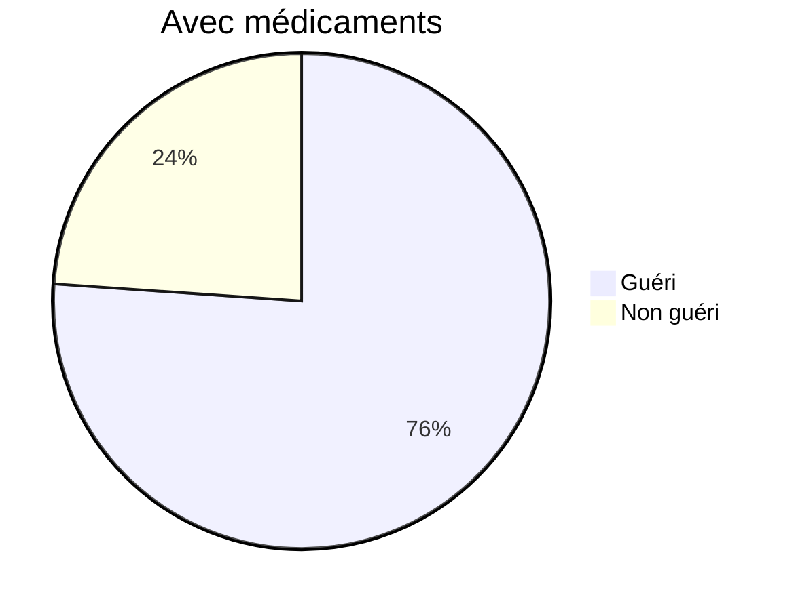
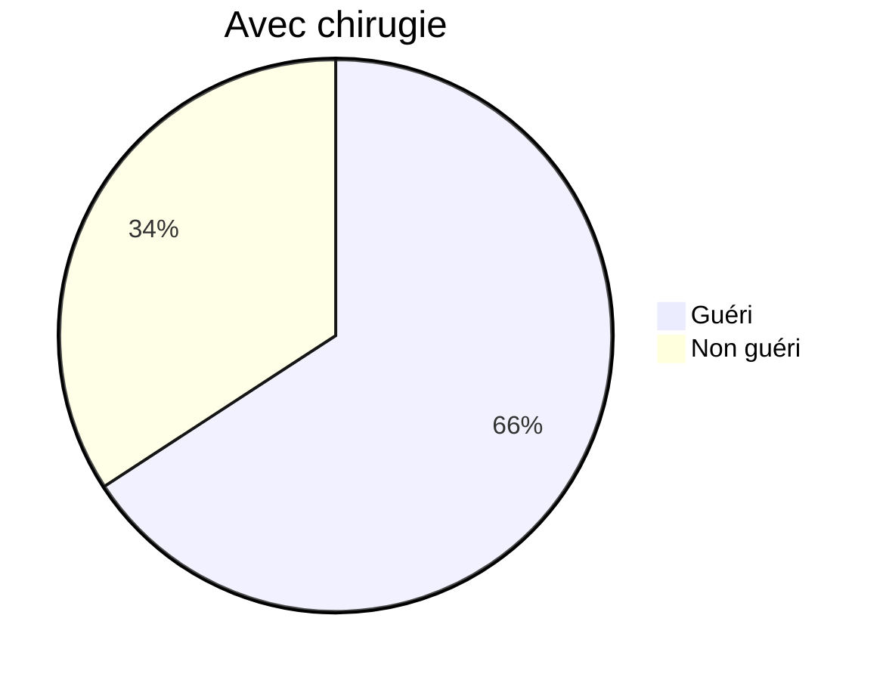
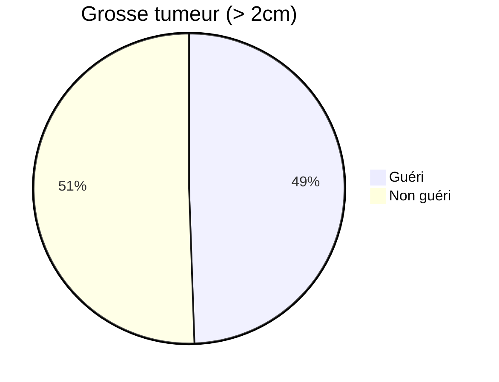
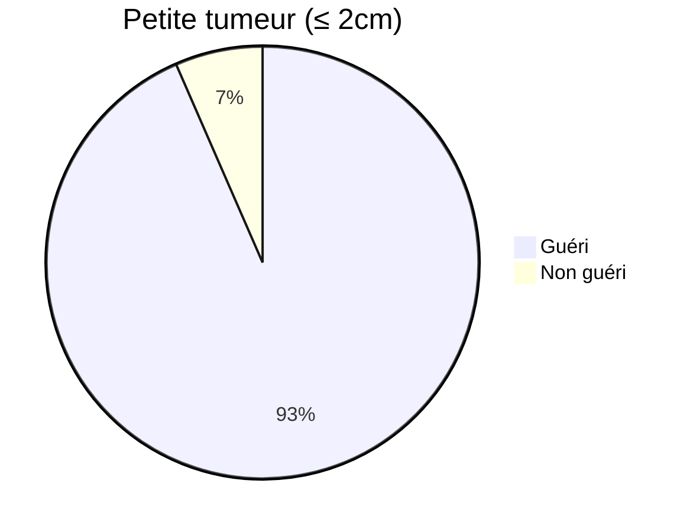
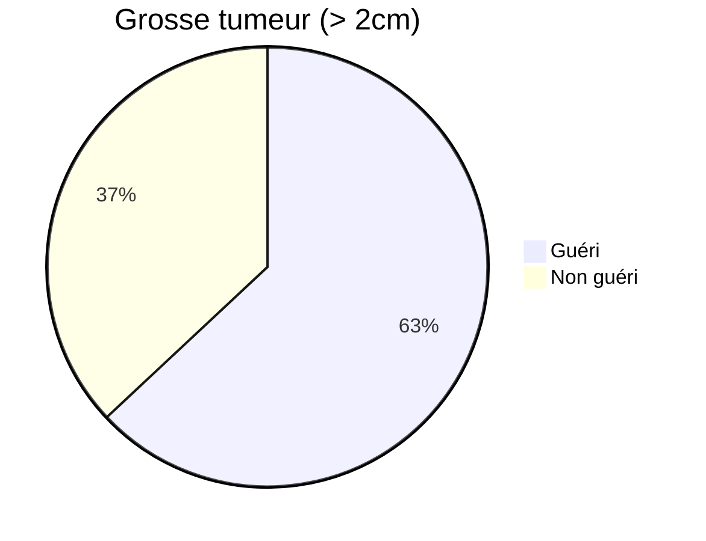
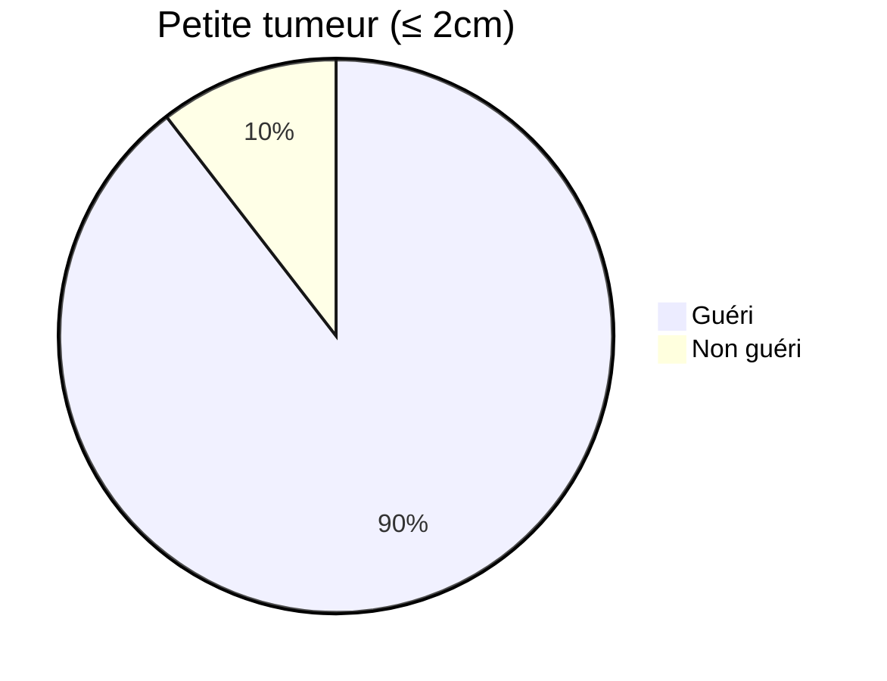

# Maths

Rappel de maths pour l'AD !

## Quelques rappel de statistiques

### Décrire un jeu de données (dataset)
* Population : prmo DI4
* Plus particulièrement le nb d'amis sur le SNS < insert_name >
* quelle structure informatique (simple) ?
* Comment décrire (simplement) ?
  - moyenne (mean/average)
  - min
  - max
  - ecart-type
  - médiane
* Comment <u>visualiser</u> (simplement) ?

## Des tendances "centrales"

### Moyenne / espérences

* Moyenne: $\displaystyle \sum^N_{i=1} \frac{x}{N}$
* Esperance: $\displaystyle E(x) = \sum^N_{i=1} p_i x_i$
* Théorème des proba
* Pour un v.a. (variable aléatoire) X
* Espérance mathématiques

#### Exemple 1: Un dé

$E(x) = \frac{1}{6} + \frac{2}{6} + ... + \frac{6}{6} = \frac{21}{6} = 3,5$

#### Exemple 2 : Random value

$[5; 3; 6; 1; 17; 80; 2]$, $E = \frac{114}{7} = 16,28$

### Médiane

* 50/50 split
* eg: $2, 5, 7, 8, 10, 14, 30$  médiane = $8$
* $2, 5, 7, 8, 9, 10, 14, 32$ médianne = $\frac{8+9}{2}$

### Quartile

* Généralisation de la médiane
* $5\%, 95\%, 10\%, ...$
* quartile = $25, 50, 70\%$
* visuel : boxpot (boite a moustache)

### Les modes (ou-dominants)
* Correspond à la/les valeur la/les plus fréquente(s)

### Wrap-up
...

## A propos de la dispersion

* Étendu ('Rangé'): (max-min), eg:
  - $L1 = [0, 100, 0, 100, 0, 100, 0, 100]$
  - $L2 = [0, 10, 20, ..., 90, 100]$
* Variance : $V(X) = E[(X-E(X))^2] = E(X^2)-[E(X)]^2$
* variance mesurée en (unité)²
* pas forcément parlant (eg: amis²)
* solution: prendre la racine $\sigma(X) = \sqrt{V(X)}$
* ecart-type ('standard déviation')
* NB: $V(X)$ et $\sigma(X)$ souffrent de la même sensibilité aux valeurs extrèmes !

## A propos de la corrélation

* Intuition/hypoth-se
  + \+ on a d'amis sur le SNS + on passe de temps dessus
* On mesure
  + daily-min = $[100.0, 68,3, 39,2, 0, \dots]$
  + daily-hours = $[\dots\ \ \dots]$
* On va s'interresser a la notion de **covariance**
  - On a $Cov(X, Y) = E((X-E(X))(Y-E(Y)))$
  - nb $Cov(X, X) = V(X)$
  - Valeur positive ou négative ?
    + $if(>0) \ \dots$
    + $if(<0) \ \dots$
    + $if(=0) \ \dots$ Pas de corrélation, les variables sont linéairement indépendantes

### Corrélation (Pearson)
* Métrique ? min/nb friend
* $\displaystyle correl(X, Y) = \frac{Cov(X, Y)}{\sigma(X)\sigma(Y)}$
* **coefficient de corrélation** (paerson)
* Valeur entre -1 et +1
  - -> +1 corrélation parfaite
  - -> -1 anti-corrélation parfaite
* même sensibilité aux valeurs extrêmes

### Wrap-up (visuel) (4.3)
(voir feuillle)

## Warning
«Il existe 3 types de mensonges: 
les mensonges et ... **les statistiques**.»  Marc Twain

* contexte : résultats médicaux
  - tumeurs !
  - 2 types de traitementss
    + (M)édicaments
    + (C)hirurgie
  - ? : plus de chance de réussite ?

**Taux de guérison (n = 1000)**

**MAIS**
* Pour les médicaments

* Pour la chirurgie

* Au global (M), si on détaille (C)
* 92 + 147 = 239
* On cherche une relation cause-effet,
traitement --> gérison ?
* La gérison dépend de plusieurs **facteurs**
* On a un facteur externe qui influe  
  -> facteur de confusion

<u>**Wrap-up**</u> 
Pour que le paradoxe puisse se produire il faut
* Une variable qui influe sur le résultat
  - Le fameux **facteur de confiance**
* Une distribution **non homogène** de la population.

### Corrélation n'est pas causalité

eg: lorsque les beaux jours arrivent
* les ventes de glaces augmentes
* (malheuresement) les coups de soleil au si

* Il y a causalité
* Peut t'on dire
  - La conso de glaces <u>**cause**</u> les coups de soleil: Non
  - Les coups de soleil <u>**pousse à**</u> la consommation de glace: Non

:::warning Spurious correlation
:::
