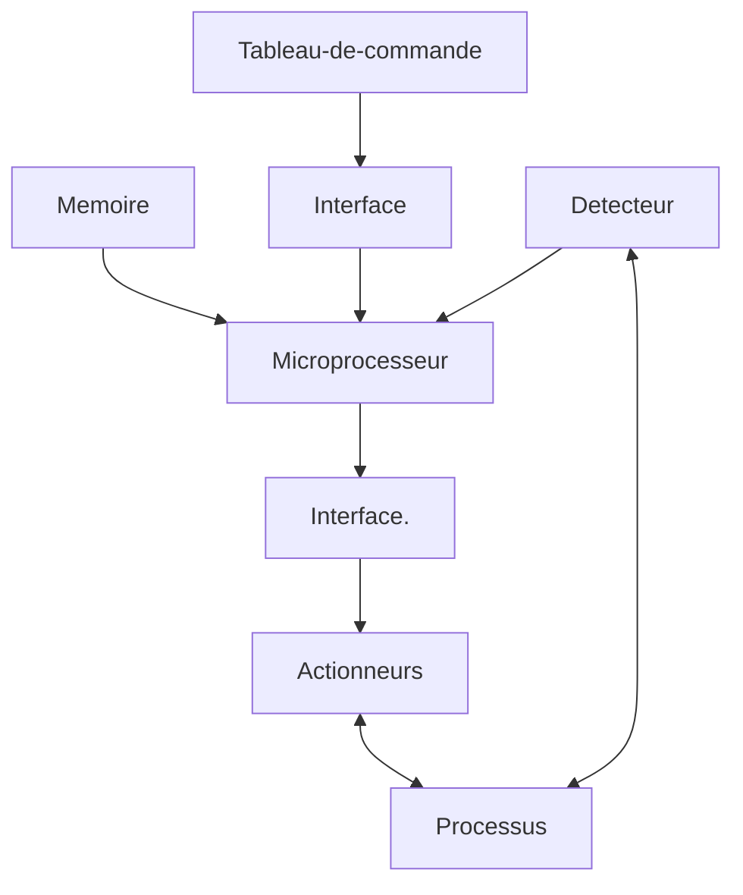

# Cours 1

# Architecture d'un microprocesseur

_schéma 1_

_schéma 2_

_schema 3_

## 3 éléments fondamentaux

* Une unité arithmétique et logique (UAL)
* Un accumulateur
* Des registres, dont les appelations sont
  - Le compteur d'instruction (CI)
  - Le registre d'état (status)
  - Le registre d'instruction (RI)
  - Le registre d'adresse (RA)

## 4004, Le premier processeur INTEL (1971)

_schéma 4004_

## Code machine

* Code Assembleur
  - LDA #$10
  - ADDA #29
  - NOP
* Code machine
  - 0000 86 10
  - 0002 8B 29
  - 0004 12
* Une instruction = Plusieurs octets/mots/...!

## Pile 

L'ors de l'appel d'une fonction la pile sauvegarde l'adresse avant l'appel d'une fonction, appel de fonction qui vient écraser dans le [CI](#3-éléments-fondamentaux) l'adresse d'une instruction par l'adresse d'une autre instruction, une fois le code éxécuté on bascule l'adresse en top de pile dans le [CI](#3-éléments-fondamentaux) pour revenir au code appelant

## Unité arithmétique et logique (ALU)

* Role
  - Traiter les données
  - Testé les données
* Toute instruction qui modifie une donnée fait appel à l'ALU
* Présence de registre tampon sur chaque entrée

### ALU sur 4 bits

_Schéma_

### Sa table de vérité

_Table de vérité_

## Accumulateur
* Registre le plus important du microprocesseur
* ...

## Structure d'une instruction
* Suite  d'instruction dans le cadre du modèle de Von Neumann
_Schéma_

## Le compteur d'instruction (PC)
* Son contenue représente l'adresse ou trouve le premier octet d'une instruction
* Il repère pointe le première octet d'une instruction
* Connecté au bus interne des données
* A la mise sous tension, une valeur partculière est déposée sur le bus d'adresses (via le registre d'adresse RA)
* Cette valeur provient des cases mémoires spécifiques (vecteur) "activées" suite à une réinitialisation du processeur.
* Il alimente le Registre d'Adresse (RA)
* Il est possible de " recharger" le PC avec une valeur (adresse) qui ne correspond pas au déroulement séquentiel du programme.
* On parle de sauts conditionnels et inconditionnels.

## Le registre d'adresse (RA)
* Le RA sert d'interface entre les bus dedonnées interne et le bus des adresses
* Il "pilote" le bus d'adresses du microprocesseur
* D'une longeur de $n$ bits

## Lien entre le PC et le RA

* Lors de l'execution d'une instruction, le contenu...

## Origine et contenu du RA

* Une incrémentation du contenu afin de lire l'information complémentaire de l'instruction en cours
...

## Le registre d'instruction (RI)
* Stocke le premier octet de l'instruction en cours d'execution.
* Celui pointé par le PC!
* Il reçoit l'information grâce au bus de données auquel il est connecté
* L'information ainsi stockée est utilisée par l'entité décodeur d'instruction

## Cycle éxtraction-éxécution
* Premier temps (1 cycle machine voire plusieurs)
  - Extraction(s) de toute l'information (code opératoire et opérandes) de la mémoire
  - Interprétation par le décodeur de l'instructions qui agit alors sur la logique de contrôle (niveaux logiques sur le bus de contrôle)
* Second temps: execution de l'instruction  
...

## Le registre d'etat

* L'existence de ce registre permet de distinguer de simple calculateur de véritable ordinateur.
* Appelé aussi registre de code condition (CCR)
* Stocke les résultats des tests efféctués par l'ALU
après traitement sur les données.
* L'existence de ces résultats permet d'écrire des programmes avec branchements conditionnels

