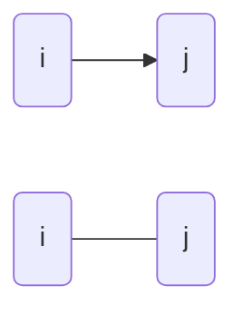
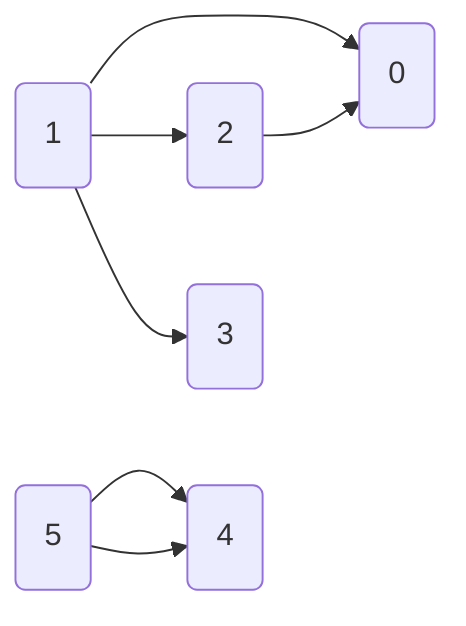
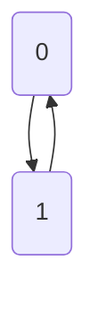
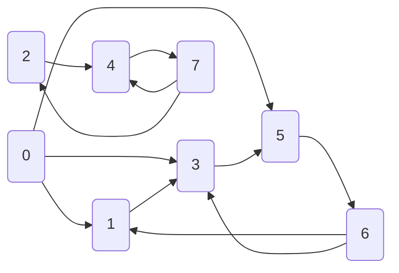

# Généralité

## Définition

Un graphe $G = [X, U]$ est défini par
* Un ensemble de sommets $X$, $|X| = N$
* Un ensemble $u$ de couple de sommets

$u = (i,j) \in U$ 
* est un arc si le couple est ordonné 
* est une arête sinon

Si $u=(i,j)$ est un arc,
* $i$ est l'origine
* $j$ est la destination

Si $u=(i,j)$ est une arête,
* $i$ et $j$ sont les extrémités

Un arc $u=(i,j)$ est une boucle

Un $p$-graphe est un graphe dans lequel il n'existe pas plus de $p$ arcs de la même forme $(i,j)$ entre 2sommets quelconques $i$ et $j$.

On note $\Gamma_j$ l'ensemble des successeurs de $j$  
On note $\Gamma_j^{-1}$ l'ensemble des prédécesseurs de $j$

Un **graphe simple**estun1-graphe
sansboucle

**Exemple**

$G$ est orienté
$N = 6$ sommets
$M = 6$ arcs

$G$ est un $2$-graphes

$\Gamma_1 = {0, 2, 3}$  
$\Gamma_1^{-1} = \empty$

La liste des arcs est

$L = \{(1, 0), (2, 0), (1, 2), (1, 3), (5, 4), (5, 4)\}

Soit $G = [X, U]$ un graphe orienté

Une **chaîne** $L$ de longeur $q$ est une séquence de $q$ arcs de la forme $L={u_1, u_2, \dots, u_q}$ telle que chaque arc $u_r$ $(2 \le r \le q-1)$ a une extrémité commune avec $u_{r-1}$ et l'autre avec $u_{r+1}$. L'extremité de $u_1$ non commune avec $u_2$ et l'extrémité de $u_q$ non commune avec $u_{q-1}$ sont des extremités de la chaîne.

**Exemple**

$L = \{(2, 0), (1, 2), (1, 3)\}$ a pour extrémités 0 et 3.
Dans une chaîne élémentaire, on ne rencontre pas deux fois le même sommet.

**Un cycle** est une chaîne dont les extrémites coincident
* Exemple: $L=\{(1, 0), (2, 0), (1, 2)\}$

Un cycle élémentaire ne contient aucun autre cycle.

Un graphe sans cycle est acyclique.

**Un chemin** est une chaîne dont tous les arcs sont orientés dans le même sens ("de parcours du chemin").

**Exemple:** $L=\{(1, 2), (2, 0)\}$

**Exemple:**

$L=\{(0,1), (1, 0)\}$ est un chemin

Un **circuit** est un chemin dont les extrémités coincident.

**Exemple**

$N = 8$ sommets, et $M = 12$ arcs

$L=\{(0,1),(1, 3), (3,5)\}$ chemin  
$L=\{(0, 1), (1, 3), (6,3),(5,6)\}$ chaîne  
$L=\{(2,4),(4,7),(7,2)\}$ circuit  
$L=\{(2,4),(7,4),(7,2)\}$ cycle  
$L=\{(0,1),(1, 3), (0,3)\}$ cycle  
$L=\{(1,3), (3,5), (5,6),(6,1)\}$ circuit  
$L=\{(0,5),(3,5),(1,3)\}$ chaîne  
$L=\{(0,5),(5,6),(6,1), (1,3)\}$ chemin  

Un graphe **biparti** est tel que $X$ peut être partitionné en $X_1$ et $X_2$ $(X_1 \cup X_2 = X \textnormal{ et } X_1 \cap X_2 = \empty)$ et $\forall u = (i,j) \in U, i \in X_1 \textnormal{ et } j\in X_2 \textnormal{ ou } i \in X_2 \textnormal{ et } j\in X_1$

Un graphe **convexe** est tel que $\forall i, j \in X^2$, il existe une chaîne reliant $i$ et $j$

## Matrice associées à un grpahe

### Matrice d'incidence sommets - arcs

$G$ graphe sans boucle,**orienté**

$\mathcal{A} = (a_{i, u})_{1 \le i \le N, 1 \le u \le M}$

$a_{iu} = +1 \textnormal{ si } i \textnormal{ est l'origine de }u, -1 \textnormal{ si } i \textnormal{ est la destination de }u, 0 \textnormal{ si } i \textnormal{ n'est pas une extrémité de }u$

Autrement dit si $u=(i,j) \in U$ alors
* $a_{iu} = +1$
* $a_{ju} = -1$
* $a_{ku} = 0, \forall k$ ...

...

### Matrice d'incidence sommets - arêtes

$G$ graphe sans boucle

$\mathcal{A} = (a_{i, u})_{1 \le i \le N, 1 \le u \le M}$

$a_{iu} = 1 \textnormal{ si } i \textnormal{ est extrémité de }u,0 \textnormal{ sinon}$

### Matrice d'incidence sommets - sommets en matrice d'adjacence

$G=[X,U]$ un $1$-graphe

$\mathcal{A} = (a_{i,ju})_{1 \le i \le N, 1 \le j \le N}$

$a_{ij} = 1 \textnormal{ si } (i, j) \in U, 0 \textnormal{sinon}$

...

Si le graphe est non orienté
$u=(i,j)\ in U \Rightarrow a_{ij} = a_{ji} = 1$  
La matrice est symétrique

## Codage d'un graphe

Les matrices spnt creuses, on utilise des vecteurs

### Liste d'adjacence

$G$ est un $1$-graphe orienté

Schéma 1

**Exemple**

$N = 8$ sommets, et $M = 12$ arcs

|          | 0 | 1 | 2 | 3 | 4 | 5 | 6 | 7  | 8  |   |    |    |
|----------|---|---|---|---|---|---|---|----|----|---|----|----|
| $\alpha$ | 0 | 3 | 4 | 5 | 6 | 7 | 8 | 10 | 12 |   |    |    |
|          |   |   |   |   |   |   |   |    |    |   |    |    |
|          | 0 | 1 | 2 | 3 | 4 | 5 | 6 | 7  | 8  | 9 | 10 | 11 |
| $\beta$  | 1 | 3 | 5 | 3 | 4 | 5 | 7 | 6  | 1  | 3 | 2  | 4  |

Le nombre de successeurs de i est $\alpha[i+1]-\alpha[i]$
Si les arcs possèdent des attributs on ajoute autant de vecteurs $\beta$ que nécéssaire.

### Liste des arêtes/arcs

$G$ sans boucle

Schéma 2

**Exemple:**

Schéma 3

Pour les attributs, on ajoute des vecteurs $\beta$
