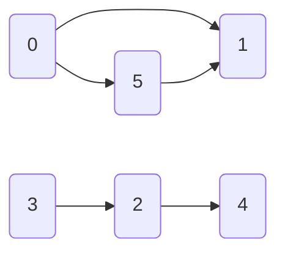

# Parcours de graphe

## Parcours

Un parcours de graphe est un algorithme qui consiste a exploirer les sommets du graphes de proche en proche, à partir d'un sommet initial.

### Parcours en profondeur

On l'implémente à l'aide d'une pile LIFO

```
Parcours_profondeur (S)
  Empiler (S)
  Marquer (S)
  
  Tantque la pile n'est pas vide faire
    Depilet j
    Marquer (j)
    Pour tout voisin (prédécesseur ou succésseur) de j non marqué faire
      Empiler (k)
    Finpour
  Fintantque
```

### Parcours en largeur

On l'implémente à l'aide d'une file FIFO

```
Parcours_largeur (S)
  Mettre S dans la file
  Marquer (S)
  
  Tantque la file n'est pas vide faire
    Retirer j
    Marquer (j)
    Pour tout voisin (prédécesseur ou succésseur) de j non marqué faire
      Mettre k dans la file
    Finpour
  Fintantque
```

On peut implémenter ces algorithmes de façon récursive

## Applications
### Connexité
$G = [X, U]$ est connexe ssi $\forall (i,j) \in X^2$, il existe une chaîne reliant $i$ et $j$

On défnit la relation

$i \mathcal{R} j \Leftrightarrow i = j \textnormal{ ou il existe une chaîne reliant }i\ et\ j$

Cette relation est
* réflexive ? oui, $i\mathcal{R}i$ ok
* symétrique ? oui, $i\mathcal{R}j \Rightarrow j\mathcal{R}i$ ok
* transitive ? oui, $i\mathcal{R}j \textnormal{ et }j\mathcal{R}k \Rightarrow i\mathcal{R}k$

Une relation d'équivalence

Les classes d'équivalence induites sur X forment une partition de $X$ en $X_1, X_2, \dots, X_p$



$p$ est appelé le nombre de connexité du graphe.

**Définition**

$G=[X,U]$ un graphe, $Y \subseteq X$

Le sous graphe $H=[Y, U']$ de $G$ relativement à $Y$ a pour sommet les dommets de $Y$ et por arcs ceux de $U$ ayant leurs deux extrémités dans $Y$.

Les sous-graphes enjendrés par les ensembles $X_1, X_2, \dots, X_p$ sont appelés les composantes connexes de $G$.

```
Cacul du nombre de Connexité (G)
  Marque[j] = 0 ∀j
  NbConnexité = 0
  Tantque min(Marque) = 0 faire
    j = 1ier sommet tel que Marque[j] = 0
    nbConnexité = nbConnexité + 1
    Empiler(j)
    Tantque pile non vide faire
      Dépiler j
      Marque[j] = NbConnexité
      Pour tout k adjacent à j faire
        Si Marque[k] = 0 alors
          Empiler k
        Finsi
      Finpour
    Fintantque
  Fintantque
```

### Existence d'un cycle

**EXERCICE**
