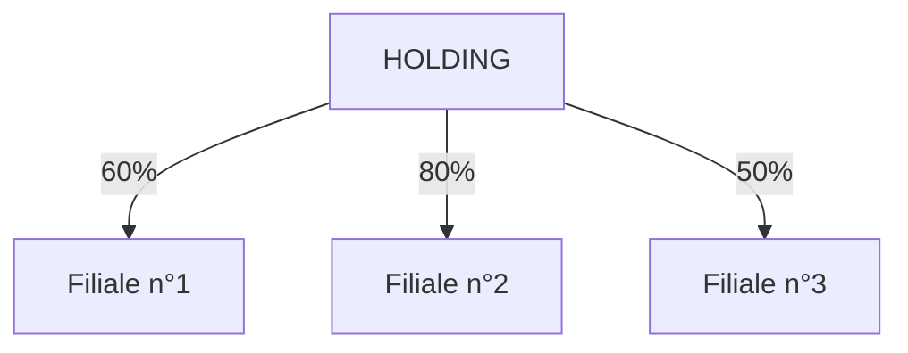

export function Red({children})
{
    return (
        
        {children}
        
    )
}

export function Green({children})
{
    return (
        
        {children}
        
    )
}

export function Blue({children})
{
    return (
        
        {children}
        
    )
}

export const Highlight = ({children, color}) => (
  
    {children}
  
);

# Droit des sociétés

Pour créer une entreprise il faut un contrat de société = acte juridique fondateur
* Conclu entre tous les associés
* Fixe les caractéristiques de l'entreprise
* Etablie les règles de fonctionnement

Un société est définit comme un <Red>**contrat**</Red>
par lequel deux ou plusieurs personnes conviennent de
<Red>**mettre en commun des biens ou leur industrie**</Red>
en vue de partager <Red>**le bénéfice**</Red> ou de profiter de l'économie qui 
pourrai en résulter.

## Le contrat

### Condition de validation d'un contrat

#### Consentement des associés
* Exempt de vice de Consentement
* Erreur
* Dol
* Violence

#### La capacité des associés:
* Majeurs capables

#### Objet de société:
* Licite
* Possible

#### Cause du contrat:
* Raison de cette entreprise
* Licite
* Morale
* Doit exister

### Le contrat identiques

#### Le nombre d'inssociés
* **SARL** : de 2 à 100 associés
* **Stés en commandite par aactoins** : au moins 3
* **SA** : au moins 7
* **SAS** : au moins 1

#### Les apports des associés

Volonté de joindre des ressources

* Apports $\Rightarrow$ parts sociales ou actions
* Droit de vote aux assemblés générales
* Droit de percevoir une partie des bénéfices

$\Rightarrow$ indicateur de confiance des associés

#### La recherche d'un but lucratif

* Explicitement : Recherche d'un gain d'argent
(ou réalisation d'économies)
***VS*** associationassociés

* Entreprises à mission

#### Un "Affecto Societatis"

* Une réelle envie de collaborer ensemble pour atteindre un but fixé
* Participation des associés à la conduite de l'entreprise

## Entreprise à mission

Forme d'entreprise qui donne comme finalité, non le profit mais,
une finalité <Green>**social ou environnementale**</Green>

* Prouver un engagement sociétale
    - Production locale, créer de l'emploi
* La formalisation d'une mission spécifique
* La cohérence du modèle économique avec la mission
* Un engagement à partager équitablement la valeur crée
* L'évaluation de la mission / de son impact sociétale

### Chiffre clés

* **70%** moins de 50 Salariés
* **57%** sont en Îls de france
* **40%** ont été créées entre 2010 et 2019

## C'est quoi une société ?

* Structure au sein de laquelle un ou plusieurs personnes se regroupe pour :
    - Exploiter une activité
    - Réaliser des économies
    - Partager des bénéfices

* Elle forme une <Blue>**personne morale**</Blue> avec une capacité
juridique propre.

## Les status

* Les apports des associés
* La forme
* L'objet
* L'appellation
* L'adresse du siège social
* Les modalités de fonctionnement
* La durée

$\Rightarrow$ Signés par tous les associés
$\Rightarrow$ Déposés au RCS - Registre du commerce et des sociétés  
&emsp; $\Rightarrow$ Imatriculation de l'entreprise <Highlight color="#0d0">**"K BIS"**</Highlight>

## Grandes caractéristiques d'entreprise

* Les entreprises individuelles
(boulanger, maçon, fleuriste, ...)

* Les sociétés de personnes
(buraliste, bistro, construction de maison)

* Les sociétés de capitaux
(Gros constructeur BTP, bourse, automobile, ...)

* Les sociétés mixte

### L'entreprise individuelle

* Entité économique qui n'a pas de personnalité juridique propre
    - confusion avec l'entrepreneur

* Peu de formalisme : pas de statut; ni de capital social
    - Confusion de patrimoins privé et professionnel
    - Risque maximum sur le patrimoine privé (dettes d'entreprise)

* L'insaisissabilité s'applique de plein droit depuis le 7 août 2015
sur cette dernière, 

* Pas d'associé <Blue>$\Rightarrow$ **Liberté totale**</Blue> dans
la prise de décisions et dans l'organisation

* Statut du dirigean : TNS  
    $\rightarrow$ Protection sociale limitée - pas de droits ass. chômage

* Comptabilité au réel : Recettes - Charges = Bénéfice

* Imposition des bénéfices à l'IRPP (Impôt sur le revenue des personnes physiques)

#### $\Rightarrow$ Focus micro entreprise

* Idem entreprise individuelle
* Formalités encore plus simples
* Comptabilité simplifiée $\rightarrow$ Déclaration du CA mensuelle
ou au trimestre. 
Charge sociales en % du CA (+/- 12% négoce - 21% présta) 
Abattement forfaitaire pour charges (34% presta - 71% négoce)

* Plafond CA (2023)
    - $188.700$€ pour les activités de vente de marchandises.
    - $77.700$€ pour les prestations de services relevant de la
    catégorie des bénéfices industriels et commerciaux (BIC)
    ou les bénéfices non commerciaux (BNC)

Franchise de TVA jusqu'à un certains seuils

<Blue>**$\Rightarrow$ La forme la plus ismple et souple d'entreprise**</Blue>

### Les sociétés mixtes

#### $\Rightarrow$ SASU : société par action simplifiée unipersonnelle

* Associé unique 
$\rightarrow$ Liberté dans la prise de décisions et l'organisation

* Pas de confusion des patrimoines  
$\rightarrow$ Sécurisation du patrimoin personnel

### Les sociétés de capitaux

#### $\Rightarrow$ SARL : société à responsabilité limitée
* Associés : entre 2 et 100 
$\rightarrow$ Personnes physiques ou morales

* Capitale social  
$\rightarrow$ Libre (1€) - Fixé par les associés mais cohérent avec
les besoins de l'entreprise  
$\rightarrow$ Fixe ou variable  
$\rightarrow$ En espèces ou en nature

* Responsabilité des associés $\Rightarrow$ Limitée à leur apport 
<Blue>**$\rightarrow$ Patrimoine personnel protégé**</Blue>

* Organisation 
$\rightarrow$ 1 ou plusieurs gérants (associés ou pas)  
    &ensp; $\rightarrow$ Gérant majoritaire (+50% parts) $\rightarrow$ statut TNS  
    &ensp; $\rightarrow$ Gérant(s) minoritaire(s) $\rightarrow$ statut salarié (pas
    de chômage car acte de gestion)  
    &ensp; $\rightarrow$ Des associées : droit de vote aux AG + dividendes (retour
    sur invest)

* Transmission des parts : libre mais accord de la majorité des associés
ou condition plus contraignante

* Comptabilité  
$\rightarrow$ Classique entreprise 
$\rightarrow$ Recette - dépense = bénéfice
$\rightarrow$ Comptable interne ou externe / Expert Comptable

* Régime fiscale $\Rightarrow$ IS (Impôts sur les sociétés)

Taux d'impôts sur les sociétés

|    Bénéfices compris  | Chiffre d'affaire $\le 10M$€ | Chiffred'affaire $> 10M$€ |
|-----------------------|------------------------------|---------------------------|
|Entre $0$€ et $42.500$€|            $15\%$            |             $25\%$        |
| Au delà de $42.500$€  |            $25\%$            |             $25\%$        | 

#### $\Rightarrow$ SARL : société à responsabilité limitée

* Associés : Minimum 7 & pas de minimum  
$\rightarrow$ Personnes physuques ou morales 
$\rightarrow$ Exemple des sociétés cotées en bourse

* Capital social  
$\rightarrow$ Minimum $37K$€ est toujours cohérent avec
les besoins de l'entreprise  
$\rightarrow$ Forcément en espèces$\rightarrow$

* Responsabilité des associées $\Rightarrow$ Limitée à leur apport 
<Red>$\rightarrow$</Red> <Blue>**Patrimoine personnel protégé**</Blue>

* Fonctionnement  
&ensp; 1 conseil d'administration (3 à 18 actionnaires)  
$\Rightarrow$ Détermine les orientations de l'activité et veille à la mise
en oeuvre, le DG es tnommé par le conseil d'administration  
$\Rightarrow$ Assure la gestion courante  
$\Rightarrow$ Relations avec les tiers

* Les actionnaires  
    AG une fois par mois minimum 
    $\Rightarrow$ approbation annuelle des comptes
    AG ordianaire pour le vote des comptes et stratégie  
    $\Rightarrow$ Droit à percevoir des dividendes sur bénéfices

* Fiscalité  
$\rightarrow$ Impôt sur les sociétés  
$\rightarrow$ Obligation de faire valider les comptes par un commisaire aux comptes

* Les dirigeants : PDG et DG  
$\rightarrow$ Statut assimilé salarié = Sécu + cotisations retraite  
$\rightarrow$ Mais pas de cotisations et droits assurance Chômage  
$\rightarrow$ Révocation possible sans préavis

* Actionnaires  
$\rightarrow$ Un ou plusieurs actionnaires  
$\rightarrow$ Personnes physiques ou morales

* Capital social  
$\rightarrow$ Minimum $1$€ et toujours cohérent avec les besoins de l'entreprise  
$\rightarrow$ Forcément en espèces

* Responsabilité des associés $\Rightarrow$ Limitée à leur apport  
<Blue>**$\rightarrow$ Patrimoine personnel protégé**</Blue> 

* Fonctionnement $\Rightarrow$ Grande souplesse  
$\rightarrow$ Président nommé par les actionnaires / ou diréction collégiale  
$\rightarrow$ Dirigeant actionnaire : ou pas  
$\rightarrow$ Personne physique ou morale

* Relations vis-à-vis des tiers  
$\rightarrow$ Président  
$\rightarrow$ DG ou DG délégué

* Les dirigeants : Président  
Statut assimilé salarié = Sécu + cotisation  + retraite  
Mais pas de cotisation et droit à l'assurance chômage  
Révocation possible sans préavis

* Associés  
$\rightarrow$ 2 ou plus (pas de maxi)  
$\rightarrow$ Personnes physiques ou morales  
$\Rightarrow$ Tous la qualité de comerçant $\rightarrow$ Majeurs
capable exclusivement  
Pas de K minimum obligatoire

* Responsabilité des associés  
<Blue>**$\rightarrow$ Solidaire & indéfinie**</Blue> de tous
les associés pour les dettes de l'entreprise

* Fonctionnement  
$\rightarrow$ 1 ou plusieurs gérants (associés ou non)
$\rightarrow$ Pouvoir fixés dans les statuts
$\rightarrow$ Si rien de prévu $\Rightarrow$ Tous les associés sont gérants

* Décision  
$\rightarrow$ Prise en AG l'unanimité  
$\rightarrow$ Cession de parts $\dots$

* Régime fiscal  
$\rightarrow$  "Transparent à l'impôt" $\Rightarrow$ IRPP des associès  
$\rightarrow$ Possibilité d'opter pour l'IS  

* Imposition des associés  
$\rightarrow$ Sur les bénéfices (BIC)  
$\rightarrow$ Eventuelles salariés

* Régime social du gérant (TNS ?)

### La Holdings

Une structure qui detient partiellement ou totalement d'autres sociétés

Son rôle : diriger, contrôler et gérer ses sociétes filles.
La filliale est détenue par la holding à hauteur de 50% ou +

* Avantages juridiques & opérationnels  
$\rightarrow$ Pouvoir agir & décider sur l'ensemble du groupe  
$\rightarrow$ Distribuer les dividendes de façon optimale  
$\rightarrow$ Simplifier la gestion

* Avantages financiers
    - Gérer & Encadrer les flux financiers = **convention de trésorie**

* Avantage de Transmission
    - Préparer la donation avant cession

* Avantage fiscaux
    - Fiscalité avantageuse & attractive  
    $\Rightarrow$ Régimes fiscaux spécifiques sous conditions

**Mère-fille**
* Holding propriétaire des parts de la filliale
* Participation d'au - 5% des parts
* Détention des titres depuis 2 ans
* Filiales devant être soumis à l'IS

**Intégration fiscale**
* Holding doit détenir au moins :
    - 95% du capital de la filiale
    - 95% des droits de vote de la filiale
* Filiales doivent être soumises à l'IS

## Quelles sont les structures juridiques possibles

Structures sociètales
* Ex SARL Unipersonnelle "EURL"
* Société à Responsabilité Limitée "SARL"
* Société Anonyme "SA"
* Société par Actions Simplifiés "SAS"
* Société en nom collectif "SNC"

## Quels sont les différents paramètres d'une entreprise ?

* Nombre d'associés
* Nature de la structure
* Le régime social & fiscal
* La responsabilité du chef d'entreprise

## Focus résponsabilité du dirigeant

Quelque soit la structure de sa société
* Responsabilité civile et pénale des dirigeants
    - En cas de faute de gestion
    - Malversations
    - Manipulation des comptes

En cas d'infraction : violation de la loi
* Résultant d'une action ou omission
* Commise par la personne morale ou physique

### 3 élément qui déterminent l'infraction

#### Légal
* Provient du réglement de la loi
* Se réfère au code pénal & du code de commerce

#### Matériel
* Réside dans un action ou une omission
* Ex: détournement de biens sociaux, non réévaluation des faits par le CAC

#### Moral
* Correspond à la volonté ou à la conscience de l'auteur de l'acte
matériel de violer la loi
* Avec intention criminelle = acte voulu & ses conséquences
* Non intentionnelle "délit d'imprudence ou négligence" =
acte voulu mais non ses conséquences

#### Les coupables

##### L'auteur
* Personne physique ou morale qui exécute matériellement l'acte
prohibé par la loi

##### Le complice
* Personne physique qui aide ou apporte son assistance à faciliter
la préparation ou la consommation de l'infraction de façon consciente.

### Les infractions

* Malversations: Escroquerie, recel, faux & usage de faux
* Abus de confiance
* Abus de biens sociaux
* Faute de gestion
* Manipulation des comptes
* distribution de dividendes fictif