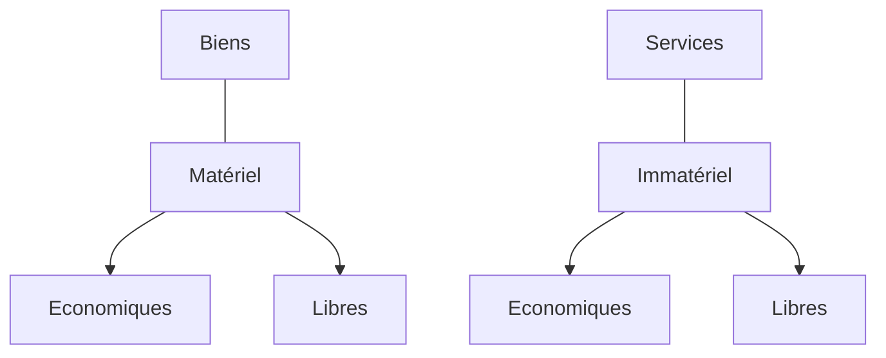
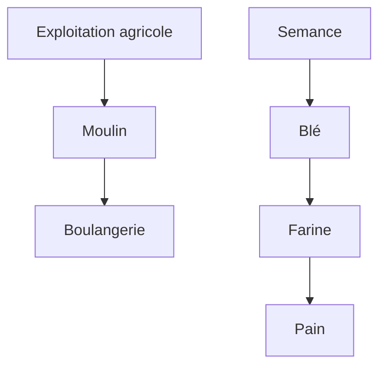
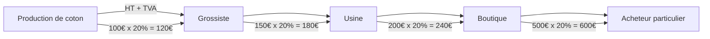

export function Red({children})
{
    return (
        
        {children}
        
    )
}

# L'economie

Le terme **économie** (oikonomia) signifie, depuis que les Grecs l'ont introduit, <Red><u>**administration de la maison**</u></Red>

L'écnomie est l'ensemble des activités d'une collectivité humaine relatives à la production, à la distribution, aux échanges et à la consommation des richesses (biens et services).

En français "économie" est aussi synonyme de "parcimonie"

Par extension, est économique tout ce qui permet d'atteindre l'objectif fixé avec un minimum de moyens.

L'économie, on parle de "triste science" car on doit produire plus avec une quantité limité de ressource

"Comprendre l'économie, c'est comprendre le monde dans lequel on vit"

La date du jour de dépassement des ressource continue d'être de plus en plus tôt

Ex :
    * En france c'est le 14 mai
    * Au Quatar c'est le 11 février

## Les principaux indicateurs économiques

* Microéconomie = Entreprise
* Macroéconomie = Un état
* Economie internationale = Le monde

Les 3 grandes questions de la microéconomie :
* Que produire ?
* Comment produire ?
* Pour qui produire

Les  3 grandes questions de la macroéconomie :
* Comment agir sur le niveau de vie ?
* Comment déterminer le coût de la vie ?
* Comment gérer les cycles ?

### Les 5 agents économiques

#### Les ménages

Ménages collectifs
* Couples
* Familles

Ménages individuels
* Célibataires
* Colocation

Principale fonction économique : <Red>**Consommer**</Red>

#### Les entreprises

Principale fonction écoomique : <Red>**Produire des biens et des services**</Red>

#### Les administrations

(Commune - Com'com (Communauté de commune) - Département, Région, Etat) - Sécurité sociale

Principale fonction économique : <Red>**Rendre des services non marchands**</Red>

Source de revenue
* Impôts
* TVA (20% et 5,5% sur les produits de première nécéssité)

#### Les banques

Principale fonction économique : <Red>**Collecter les dépôts des entreprises des ménages et faire des crédits**</Red>

#### Le reste du monde

Principale fonction économique : <Red>**Exporter et importer des biens et des services**</Red>

### Biens et services

* Les services : "objets" immatériels

* Les biens : objets matériels
    - Les biens de production : qui servent à produire d'autre biens ou des services
    - Les biens de consommation

Un bien de **production** est un bien qui permet de de créer un service

Un bien de **consommation** est un bien uniquement utilisé pour sa consommation propre

<u>Ex:</u> 
Une voiture, un bien de production mais si c'est utilisé pour être un taxi cela
devient un bien de production

* Les biens de production
    - Durable : ex Machine industrielle
    - Consomptible : L'éléctricité
* Les biens de consommation
    - Durable : ex Mazzerati
    - Consomptible : Une pomme
* Les biens individuels :
    - Biens à usage exclusif financé par le bénéficiaire (ex : sandwitch)
* Les biens collectifs
    - Biens indivisibles
    - Le fait qu'un individu en profite n'en prive pas les autres

### Secteurs d'activités

* Primaire  
Exploitation du sol et des matières premières.
    - Agriculture
    - Sylvieculture
    - Elevage
    -Extraction minière
    - Etc...

* Secondaire  
Industrie de transformation des matières premières
    - Eléctricité
    - Construction
    - Transformation
    - Menuiserie
    - Etc...

* Tertiaire  
Entreprises des services
    - Banques
    - Assurances
    - Transports
    - Administration
    - Santé
    - Loisirs
    - Etc...

### <Red>Le PIB</Red>

Le PIB est une **mesure de la production économique.**

Cette mesure est basée sur le système d'informations
performant qui donne une vision juste de l'état d'une économie.

Le PIB est utilisé pour mesurer la "**Croissance économique**" d'un pays

La calcul du PIB correcpond à la <Red>**la somme des valeurs ajoutées**</Red>
à l'aquelle s'ajoute la <u>**taxe sur la valeur ajoutée**</u> (TVA) mais aussi
les **taxes** sur des produits particuliers comme les produits pétroliers,
le tabac et l'alcool ou encore les produits importés (droit de douanes).

En contrepartie de ces taxes, **les subventions** reversées par l'Etat sont
logiquement retranchées.

Il y a le PIB réel et le PIB par habitant qui est le PIB réel / le nombre d'habitant.

### La valeur ajoutée

**La valeur ajoutée** est la différence entre le prix de vente et le coût de production

### Croissance économique

La **croissance** économique est l'augmentation soutenue de la production
de biens etde services sur une longue période.

#### L'expansion économique

L'expansion économique est l'augmentation de la richesse d'un pays

#### La récession économique

La récession économique est la régréssion de la richesse d'un pays

### De nouveaux indicateurs de richesse émerges

* Le taux **d'emploi**
* L'effort de **recherche**
* **L'endettement**
* L'espérance de vie en bonne **santé**
* **Satisfaction** dans la vie
* Inégalités de **revenus**
* **Pauvreté** en condition de vie
* Sorties précoces du système **scolaire**
* Empreinte **carbone**
* Artificialisation des **sols**

---

## La formation des prix

### Phase de conception

* Equipe conception
* Etude
* Dépôt de brevet
* Premiers prototypes

### Calcul du coût d'achat des matières premières

* Prix d'achat
* Frais de Transports
* Droits de douanne
* Assurance

### Charge de production

* Bâtiment industriel
* Machine outil
* Salariés de production
* Fluides
* Assurances

### Coûts hors production

* Coûts de gestion
* Coûts de vente
* Frais administratifs

$\Rightarrow$ **Le tout donne le coût de revient**

\+ Marge (quand même !)

$\Rightarrow$ Prix de vente hors taxes

### Il ne reste plus qu'a ajouter la TVA

Taux normal : **20%**

Taux réduit : **5,5%** (alimentation, cantines, scolaires,
hygiène, livres, ciné, spectacles, abonnement éléctricité,
énergies renouvelables, travaux isolations....)

Taux particulier : **2,1%** (médicaments remboursés par la sécu,
presse...)

### Taxe sur les carburants

Sur le gazole par exemple  pour 1,67€ le littre
* Coût des matières premières 0,54€
* Coût d'approvisionnement 0,24€
* Taxes sur les carburants 
* Taxes ecologique

Taxes à **67%**

$\Rightarrow$ **Prix de vente HT**

\+ **TVA**

$\Rightarrow$ Prix de vente TTC

Coût d'achat + Charges de production = Coût de production

Coût de production + Coût hors production
(coût de distribution + coût administratif)
= Coût de revient

Coût de revient + Marge (Bénéfice) = Chiffre d'affaire

$\Rightarrow$ **Les éléments qui vont faire
augmenter le prix de vente ?**

## Les différents types de marché

Le taleau de Stackelberg montre **les différentes**
types de marché (situations de marché)

En fonction du nombre:  
$\Rightarrow$ **D'offreurs**  
$\Rightarrow$ **Demandeurs**

| Offreurs $\rightarrow$ Demandeurs $\downarrow$ |         Un        |    Quelques-uns   |              Multitudes         |
|----------------------------------------------------|-------------------|-------------------|---------------------------------|
| **Un**                                             | Monopole bilatéral|Monopole contratrié|               Monopsone         |
| **Quelques-uns**                                   | Monopole contrarié| Monopole bilatéral|              Oligopsone         |
| **Multitudes**                                     |      Monopole     |     Oligopole     |Concurrence pure et parfaite |

* **L'atomicité de l'offre et de la demande**: il existe une
<u>multitude d'offreurs et de demandeurs</u>, de telle sorte qu'aucun
ne puisse influencer le marché

* **La fluidité du marché**: Il n'existe pas de restrictions à l'entrée du marché,
ainsi la concurrence n'est pas figée.
* **La transparence du marché**: tous les acteurs du marché
bénéficient d'une information parfaite sur les conditions du
marché (en particulier les prix).

* **L'homogénéité du produit**: Les produits échangés sur le marché sont identiques
de telle sorte que le concurrence ne peut porter que sur le prix de production.

* **La mobilité des facteurs de production**: Les facteurs de productions
peuvent se déplacer, de manière à ce que chaque entreprise puisse profiter
des mêmes conditions de production.

* Aujourd'hui fort impact du coût du transport
    - Carburant

* **La concurrence imparfaite** se rencontre à chaque
fois qu'une condition de la concurrence pure et
parfaite n'est pas vérifiée

* La **concurrence imparfaite constitue la règle**
dans la réalité, alors que la concurrence parfaite
est **l'exception**.

On **vit dans <Red>une concurrence imparfaite</Red>**

**Le prix est l'expression monétaire de la valeur d'échange**

le prix des biens et services dépend de la
**quantité nécessaire à leur fabrication** (Inputs)

Et de **l'utilité** que procure le bien acquis

et de la **rareté** (plus un bien est rare plus il est cher)

### La loi de l'offre et de la demande

$\Rightarrow$ Le mécanisme de formation des prix en concurrence
pure et parfaite ou imparfaite

**L'offreur** cherche à maximiser son **profit**

et le **demandeur** souhaite maximiser son **utilité.** 
Ou à minimiser son **prix**.

En situation de <u>**monopole**</u> l'entreprise fixe elle-même
le prix du marché (l'entreprise est "faieur de prix")

Elle va fixer son prix afin de maximiser son profit:

**Un effet quantité / effet volume**

<u>**La fixation des prix dans l'entreprise**</u>:

$\rightarrow$ **coûts de productions** VS **prix psychologique**
accepté par les consommateurs

**Elasticité** de la demande par rapport au prix

Rapport entre la variation relative de la **demande** // la variation relative du **prix**

## L'inflation

### <Red>Définitions:</Red>
**Hausse <u>générale</u> et <u>continue</u> du prix
des biens et des services**

**L'inflation entraine mécaniquement
<Red>une baisse de la valeur de la monnaie</Red>**
* Je peux acheter moins avec le même budget
    - Baisse du pouvoir d'achat
* Baisse de l'épargne
* Valorise mes investissements
* Baisse de la valeur de l'épargne des ménages
* L'argent vaut moins
    - Baisse de la valeur de la dette (pays)

### Hauteur de la dette public
**2.843.583.854.415€**
- Elle augmente de **2640€** par seconde

### L'inflation par la demande

$\rightarrow$ **Plus de demande que d'offre**

#### Inflation par l'augmentation du coût de production
$\rightarrow$ **Les "intrants" sont plus chers**

#### L'inflation importée
$\rightarrow$ **Sur les matières premières mais pas que**

#### Le role des banques centrales : Contrôler l'inflation

**Une inflation entre 2 et 3%**

**Contrôle la masse monétaire en circulation sur le marché  
$\Rightarrow$ "déflation compétitive"**

## Le pouvoir d'achat

### Définitions:

Le pouvoir d'achat correspond à <Red>**la quantité de biens
et de services qu'un revenu permet d'acheter**</Red>.

Le pouvoir d'achat dépend alors du niveau du revenu et du
niveau des prix.

<Red>**L'évolution du pouvoir d'achat correspond donc à la
différence entre l'évolution des revenus des ménages et
l'évolution des prix.**</Red> Si la hausse des revenus est
supérieure à celle des prix, le pouvoir d'achat augmente.
Dans le cas contraire, il diminue.

L'indice de **GINI** mesure **les inégalités de revenu dans
une population**

### Pyramide de Maslow

D'abord il faut combler les besoins physiologique
ensuite les besoins de Sécurité
ensuite les besoins d'Appartenance
ensuite les besoins de l'estime de soi
et enfin le besoin d'accomplissement personnel

## Histoire du travail

* Préhistoire: Chasseurs-cueilleurs
* Moyen âge: Agriculture
* Agriculteurs et artisans locaux indépendants
* Mécanisation
* 1873 - Révolution industriel
* <Red>**Impact sur l'organisation du travail**</Red>
* <Red>**Début du salariet contemporain**</Red>
* Temps moderne
 
* <Red>**1941 : Interdiction du travail des enfants**</Red>
* <Red>**1950 : Salaire minimum garantie**</Red>
* 1982 : 35h, 5ième semaine de congés

Par rapport aux années 50 où la majorité des emloies était, 
majoritairement agricole, là ou maintenant, on est majoritairement
sur des emploies terciaire.

## Le chômage

### Définitions

Le chômage représente l'ensemble des personnes de 15 ans et plus,
privées d'emploi et en recherchant un. (INSEE)

<Red>**Inadéquation**</Red> entre l'offre et la demande du travail.

Nombre de demandeurs d'emploies <Red>**inscrit**</Red> chez pôle emploi

Un chômeur au sens du BIT est une personne âgée de <Red>**15 ans**</Red>
ou plus qui répond <u>**simultanément**</u> à trois conditions:
* être sans emploi durant une semaine donnée
* être disponible pour prendre un emploi dans les deux semaines
* Avoir cherché activement un emploi au cours des quatres dernières
semaines ou en avoir troouvé un qui commence dans moins de 3 mois.

Chômage conjonctuel
* lié à une baisse de l'activité économique
* augmente lorsque la conjoncture se dégrade
* solution pour y remédier : résorber les
déséquilibres (chômage, inflation)  
$\rightarrow$ chômage technique

Chômage structurel
* lié aux difficultés d'ajustement du marché
* persiste en période de croissance
* solution pour y remédier: accroître l'éfficacité économique 
$\rightarrow$ chômage frictionnel 
$\rightarrow$ chômage technologique 
$\rightarrow$ chômage d'inéquation 

<Red>**1958: Création de l'assurance chômage**</Red>