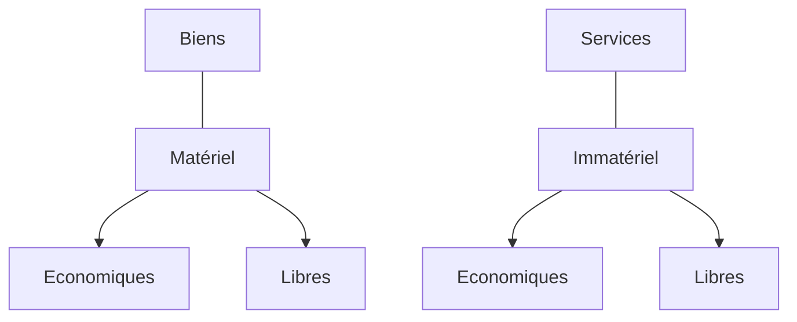
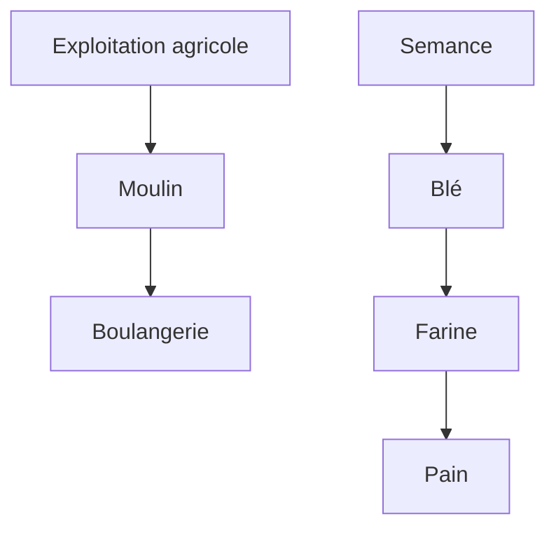

export function Red({children})
{
    return (
        
        {children}
        
    )
}

# L'economie

Le terme **économie** (oikonomia) signifie, depuis que les Grecs l'ont introduit, <Red><u>**administration de la maison**</u></Red>

L'écnomie est l'ensemble des activités d'une collectivité humaine relatives à la production, à la distribution, aux échanges et à la consommation des richesses (biens et services).

En français "économie" est aussi synonyme de "parcimonie"

Par extension, est économique tout ce qui permet d'atteindre l'objectif fixé avec un minimum de moyens.

L'économie, on parle de "triste science" car on doit produire plus avec une quantité limité de ressource

"Comprendre l'économie, c'est comprendre le monde dans lequel on vit"

La date du jour de dépassement des ressource continue d'être de plus en plus tôt

Ex :
    * En france c'est le 14 mai
    * Au Quatar c'est le 11 février

## Les principaux indicateurs économiques

* Microéconomie = Entreprise
* Macroéconomie = Un état
* Economie internationale = Le monde

Les 3 grandes questions de la microéconomie :
* Que produire ?
* Comment produire ?
* Pour qui produire

Les  3 grandes questions de la macroéconomie :
* Comment agir sur le niveau de vie ?
* Comment déterminer le coût de la vie ?
* Comment gérer les cycles ?

### Les 5 agents économiques

#### Les ménages

Ménages collectifs
* Couples
* Familles

Ménages individuels
* Célibataires
* Colocation

Principale fonction économique : <Red>**Consommer**</Red>

#### Les entreprises

Principale fonction écoomique : <Red>**Produire des biens et des services**</Red>

#### Les administrations

(Commune - Com'com (Communauté de commune) - Département, Région, Etat) - Sécurité sociale

Principale fonction économique : <Red>**Rendre des services non marchands**</Red>

Source de revenue
* Impôts
* TVA (20% et 5,5% sur les produits de première nécéssité)

#### Les banques

Principale fonction économique : <Red>**Collecter les dépôts des entreprises des ménages et faire des crédits**</Red>

#### Le reste du monde

Principale fonction économique : <Red>**Exporter et importer des biens et des services**</Red>

### Biens et services

* Les services : "objets" immatériels

* Les biens : objets matériels
    - Les biens de production : qui servent à produire d'autre biens ou des services
    - Les biens de consommation

Un bien de **production** est un bien qui permet de de créer un service

Un bien de **consommation** est un bien uniquement utilisé pour sa consommation propre

<u>Ex:</u> 
Une voiture, un bien de production mais si c'est utilisé pour être un taxi cela
devient un bien de production

* Les biens de production
    - Durable : ex Machine industrielle
    - Consomptible : L'éléctricité
* Les biens de consommation
    - Durable : ex Mazzerati
    - Consomptible : Une pomme
* Les biens individuels :
    - Biens à usage exclusif financé par le bénéficiaire (ex : sandwitch)
* Les biens collectifs
    - Biens indivisibles
    - Le fait qu'un individu en profite n'en prive pas les autres

### Secteurs d'activités

* Primaire  
Exploitation du sol et des matières premières.
    - Agriculture
    - Sylvieculture
    - Elevage
    -Extraction minière
    - Etc...

* Secondaire  
Industrie de transformation des matières premières
    - Eléctricité
    - Construction
    - Transformation
    - Menuiserie
    - Etc...

* Tertiaire  
Entreprises des services
    - Banques
    - Assurances
    - Transports
    - Administration
    - Santé
    - Loisirs
    - Etc...

### <Red>Le PIB</Red>

Le PIB est une **mesure de la production économique.**

Cette mesure est basée sur le système d'informations
performant qui donne une vision juste de l'état d'une économie.

Le PIB est utilisé pour mesurer la "**Croissance économique**" d'un pays

La calcul du PIB correcpond à la <Red>**la somme des valeurs ajoutées**</Red>
à l'aquelle s'ajoute la <u>**taxe sur la valeur ajoutée**</u> (TVA) mais aussi
les **taxes** sur des produits particuliers comme les produits pétroliers,
le tabac et l'alcool ou encore les produits importés (droit de douanes).

En contrepartie de ces taxes, **les subventions** reversées par l'Etat sont
logiquement retranchées.

Il y a le PIB réel et le PIB par habitant qui est le PIB réel / le nombre d'habitant.

### La valeur ajoutée

**La valeur ajoutée** est la différence entre le prix de vente et le coût de production

### Croissance économique

La **croissance** économique est l'augmentation soutenue de la production
de biens etde services sur une longue période.

#### L'expansion économique

L'expansion économique est l'augmentation de la richesse d'un pays

#### La récession économique

La récession économique est la régréssion de la richesse d'un pays

### De nouveaux indicateurs de richesse émerges

* Le taux **d'emploi**
* L'effort de **recherche**
* **L'endettement**
* L'espérance de vie en bonne **santé**
* **Satisfaction** dans la vie
* Inégalités de **revenus**
* **Pauvreté** en condition de vie
* Sorties précoces du système **scolaire**
* Empreinte **carbone**
* Artificialisation des **sols**