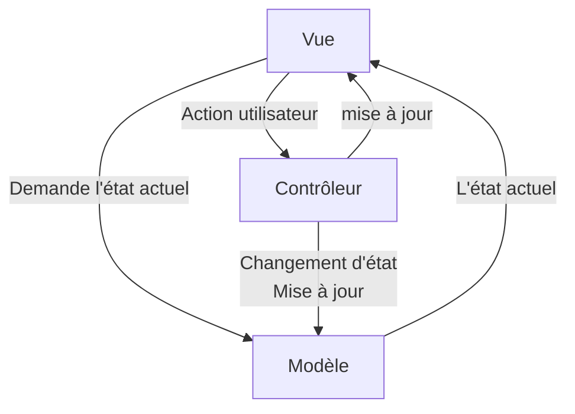
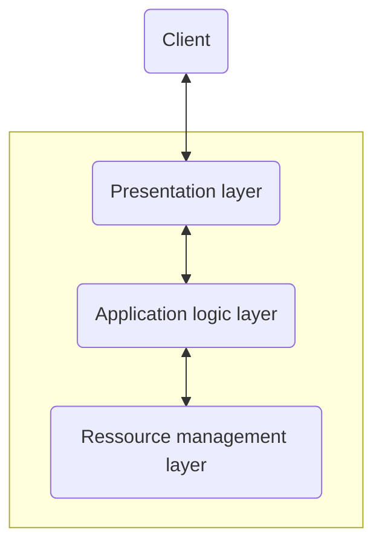

# Mise en œuvre d'un SGBD dans un langage hôte (python)

## Le patron de conception MVC



## Architechture d'un système d'information



## Le patron de conception DAO

* **DAO** (Data Access Object) est un patron de conception
* Dans **Python**, DAO souvent utilisé pour isoler la logique d'accès aux données de la logique métier de l'application
* Les objets stockés en mémoire vive sont fréquemment associés à des données persistantes (stockées dans des bases de données).
* DAO permet de 
    - Regrouper les accès aux données persistantes dans des classes au lieu de les disperser
    - Éviter d'écrire ces accès dans les classes "métier", qui ne changent qu'après les règles de gestion métier changent.

### Exemple en python

```py
import mysql.connector

class User:
    def __init__(self, id, username, email):
        self.id = id        
        self.username = username
        self.email = email
```

```py
class UserDAO:
    def __init__(self, host, user, password, database):
        self.conn = mysql.connector.connect(
            host=host,
            user=user,
            password=password
            database=database
        )
        self.cursor = self.conn.cursor()
```
```py
def create(self, user):
    self.cursor.execute("INSERT INTO users (id, username, email) VALUES (%s, %s, %s)", (user.id, user.username, user.email))
    self.conn.commit()
```
```py
def __del__(self)
    self.conn.close()
```