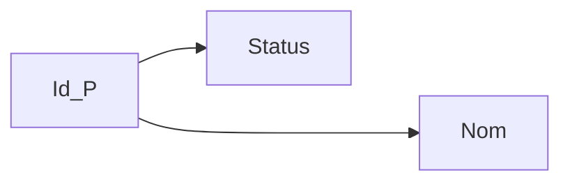
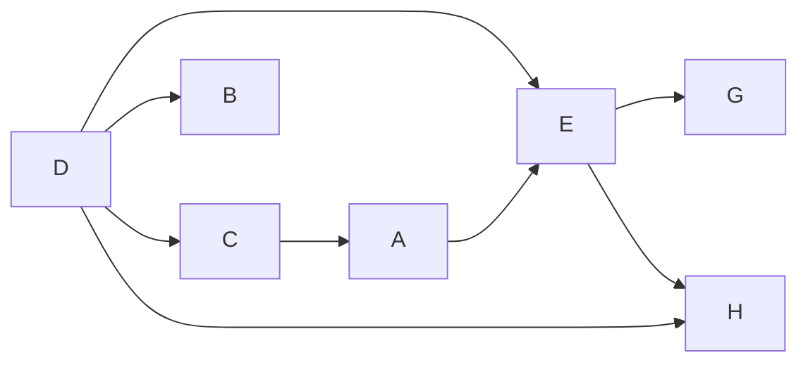
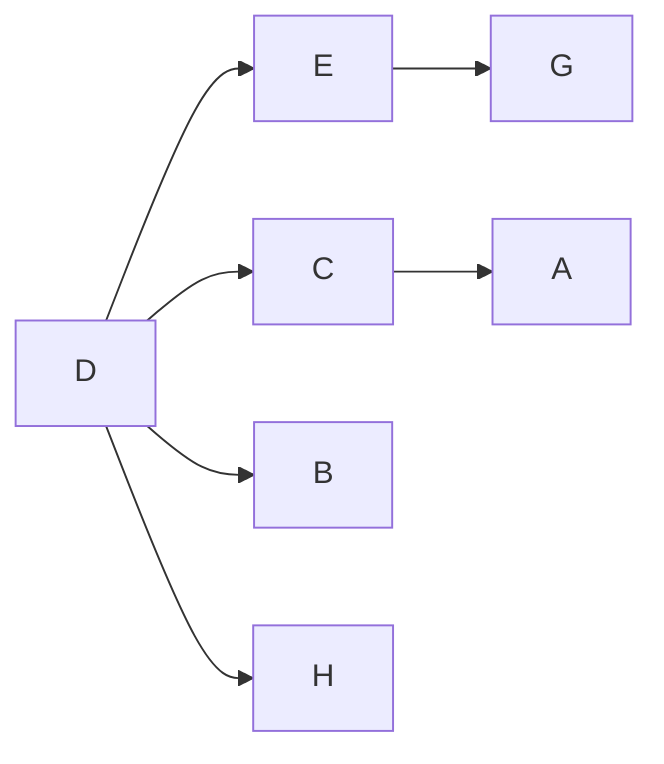

# SQL

## Groupe

```sql
SELECT * FROM <table_>
WHERE <condition>
GROUP BY <attributs>
HAVING <condition>
```

Exemple pilotes

```sql
SELECT IdPil
FROM Vol
GROUP BY IdPil
```

| Résultat | IdPil |
|----------|-------|
|          |   1   |
|          |   2   |
|          |   3   |

```sql
SELECT IdPil, COUNT(*) as nombre
FROM Vol
GROUP BY IdPil
```

| Résultat | IdPil | nombre |
|----------|-------|--------|
|          |   1   |    2   |
|          |   2   |    2   |
|          |   3   |    3   |

```sql
SELECT IdPil, COUNT(DISTINCT IdAv) as nombre
FROM Vol
GROUP BY IdPil
```

| Résultat | IdPil | nombre |
|----------|-------|--------|
|          |   1   |    2   |
|          |   2   |    1   |
|          |   3   |    2   |
### Avoir la liste de tout les pilote qui vole sur tout les avions avec `GROUPE BY`

```sql
SELECT IdPil
FROM Vol
GROUP BY IdPil
HAVING COUNT(DISTINCT IdAv) = (SELECT COUNT(*)
                               FROM Avion+)
```


## Gestion d'une base de donnée

### Création
```sql
CREATE { DATABASE | SCHEMA } <nom_base>
```

### Suppression

```sql
DROP { DATABASE | SCHEMA } <nom_base>
```

### Création de table
```sql
CREATE TABLE <nom table>
    (colonne1 nom_colonne contrainte_de_colonne)
    (colonne2 nom_colonne contrainte_de_colonne)
    (colonne3 nom_colonne contrainte_de_colonne)
```

### Suppression de table

```sql
DROP TABLE <nom table>
```

### Contrainte de colonne

* **NOT NULL** : valeur nulle impossible
* **DEFAULT** : valeur par défaut
* **PRIMARY KEY** : colonne considéré comme clé primaire
* **REFERENCES** table_ref : contrainte de référence sur une autre table
* **CHECK** condiiton_val : contrainte sur la valeur d'une colonne

### Contrainte sur une table

* **UNIQUE**
*

* ```sql
   FOREIGN KEY (liste_col)
   REFERENCES table_ref (colonnes_ref)
   [ON DELETE reference_option]
   [ON UPDATE reference_option]
  ```

reference_option:
```sql
RESTRICT | CASCADE | SET NULL | NO ACTION
```
* `RESTRICT`: aucun effet car la CI ne doit pas être brisée
* `RESTRICT`: en cas de suppresision d'un enregistrement, les enregistrements
qui les références sont eux ausso supprimés. Attention coût de traitement très élevé
* `SET NULL`: en cas de suppression d'un enregistrement, la clef étrangère est mis à NULL
* `NO ACTION`: ne fait rien

## Index

### Création d'un index

```sql
CREATE [UNIQUE] INDEX <nom>
```

### Suppression d'un index

```sql
DROP INDEX <nom>
```

## Trigger

* L'instruction `CHECK(<condition>)` sur un oou plusieurs attributs.
Portées limitée avec test à des instants précis : sur insertion ou mise à jour de l'enregistrement courant
* Les assertions qu'une application doit vérrifier sont souvent plus difficile à vérifier

```sql
CREATE ou REPLACE TRIGGER <event>
```

Exemple:
```sql
CREATE TRIGGER T_nouveaute
    AFTER INSERT ON Vendre
    FOR EACH ROW
        IF (new.nomP <> ALL (SELECT nomP FROM Produit))
            INSERT new INTO Produit
```

## Contrôle des données: les vues

Rôle d'une vue
* Préserver la confidentialité des données
* Augmenter l'indépendance logique

* Utilisation des des pour:
    - Interdire l'accès à certaines colonnes
    - Interdire l'accès à certaines données

Une vue est calculé lorsqu'elle est appellé dans la clause
FROM d'un requete

```sql
{ CREATE | REPLACE } VIEW <nom_vue> AS
{Instruction SELECT}
```

```sql
DROP VIEW <nom_vue>
```

## Priviliege

```sql
CREATE USER <user> [IDENTIFIED BY <password>]
```

```sql
GRANT {ALL PRIVILEGES | SELECT | INSERT | ... } ON [Relation entre objet] TO <liste d'utilisateur> [WITH GRANT OPTION];
```

```sql
REVOKE {ALL PRIVILEGES | SELECT | INSERT | ... } ON [Relation entre objet] FROM <liste d'utilisateur>;
```

## Propriété d'un SGBD : ACID
* **Atomicité**
* **Cohérence**: Préserver l'intégrité des données
* **Isolation**: Aucune action simultané ne doit interféré
* **Durabilité**

## Exemple TP

```sql
SELECT `prenomP` 
FROM `pilote` 
WHERE `villeP` = "Paris" 
AND prenomP <> "Jean";

SELECT `IdAvion` 
FROM `avion` 
WHERE `cap` > 250 
OR base = "Paris";

SELECT DISTINCT `IdPilote` 
FROM `vol` 
WHERE `IdAvion` = 2 
OR `IdAvion` = 3;

SELECT AVG(`cap`) 
FROM `avion`;

SELECT MAX(`cap`) 
FROM `avion`;

SELECT * 
FROM `pilote` 
JOIN `vol` ON `pilote`.`IdPilote` = `vol`.`IdPilote`;

SELECT `pilote`.`prenomP` 
FROM `pilote` 
JOIN `vol` 
ON `pilote`.`IdPilote` = `vol`.`IdPilote` 
AND `vol`.`villeD` = "Toulouse";

SELECT `pilote`.`IdPilote`, `vol`.`IdAvion` 
FROM `vol` 
JOIN `pilote` ON `pilote`.`IdPilote` = `vol`.`IdPilote` 
ORDER BY `pilote`.`IdPilote`;

SELECT `pilote`.`IdPilote`, `vol`.`IdAvion` 
FROM `vol` 
RIGHT OUTER JOIN `pilote` ON `pilote`.`IdPilote` = `vol`.`IdPilote` 
ORDER BY `pilote`.`IdPilote`;

SELECT DISTINCT `nomA` 
FROM `avion` 
WHERE `cap` = (SELECT MAX(`cap`) FROM `avion`);

INSERT INTO `avion` 
VALUES (5, "Airbus A380", 450, "Paris");

DELETE FROM `avion` 
WHERE `IdAvion` = 5;

INSERT INTO `avion` (`nomA`, `cap`, `base`) 
VALUES ("Airbus A380", 450, "Paris");

UPDATE `avion` 
SET `cap` = 550
WHERE `nomA` = "Airbus A380";

DELETE FROM `avion` 
WHERE `nomA` = "Airbus A380";

SELECT `pilote`.`prenomP` 
FROM `pilote` 
LEFT OUTER JOIN `vol` ON `vol`.`IdPilote` = `pilote`.`IdPilote` 
WHERE `vol`.`IdPilote` IS NULL;

SELECT DISTINCT `pilote`.`prenomP` 
FROM `pilote` 
INNER JOIN `vol` ON `vol`.`IdPilote` = `pilote`.`IdPilote`
WHERE `vol`.`villeD` != "Lyon";

SELECT DISTINCT `pilote`.`IdPilote` 
FROM `pilote` 
INNER JOIN `vol` ON `vol`.`IdPilote` = `pilote`.`IdPilote` 
WHERE `vol`.`IdAvion` IN (2,3);

SELECT DISTINCT `v1`.`IdPilote` 
FROM `vol` AS `v1`
INNER JOIN `vol` AS `v2` ON `v1`.`IdPilote` = `v2`.`IdPilote` AND `v2`.`IdAvion` = 3
WHERE `v1`.`IdAvion` = 2;
```

# Mise en oeuvre d'un SGBD

## Principaux moteur de stockage

**Les deux principaux:**

* **InnoDB**: Moteur de table transactionnel
* **My ISAM**: Simple et rapide. Moteur qui ne gère pas les transactions

### InnoDB
* Moteur plus récent
* Gestion des clés étrangères
* Moteur transactionnel
* Plus lent en écriture que MyISAM
* Nécessite de faire des réglages pour bien l'utiliser (administration)
* Besoin de plus d'espace disque

### MyISAM
* Moteur historique de MySQL
* Rapide pour les requêtes de lecture et d'écriture (`SELECT`, `INSERT`)
* Ne gère pas les clés étrangères
* Seul à gérer les index « Fulltext »
* Facile à administrer
:::note
A utiliser si on veut juste séléctionner et inserer pas forcément de mise en relation
:::

### Les autres
* **MEMORY**
* **MERGE**
* **ARCHIVE**
* **CSV**

## Architecture PHP
### Architecture 3 Tiers
* Couche présentation
* Couche métier
* Couche accès aux données

#### Couche présentation
* Partie visible pa l'utilisateur

#### Couche metier
* Partie logique
* Application pour répondre à l'utilisation

#### Couche accès aux données
* Gère l'accès aux données (stockage, méthode d'accès), géré les outils MySQL

### Logiciels mettant en oeuvre

* **Apache**
* **PHP**
* **MySQL**

## Optimiseur de requêtes

L'optimiseur travaille en 2 phases:
* **Optimisation logique** : réécriture sous une forme canonique simplifiée e toptimisée, sans tenir compte des coûts d'accès aux données

* **Optimiseur physique**

### Différent type de requête
* **Requête statique**: écriture en dur dans le code éventuellement paramétrée par des variables.
    - Optimisée une seule fois lors de la compilation du programme.
    Ensuite requête très souvent executé
* **Requête dynamique**

### Étape d'analyse d'une requête
* Analyse syntaxique
* Mise sous forme canonique
* Arbre d'opération de l'AR : plusieurs arbres possibles
* Génération des plans d'éxecution.
* Optimisation des plans d'execution : calcul du coût de l'éxécution
d'une requête

#### Mise sous forme canonique
* Commutativité des jointures
* Associativité des jointures
* Fusion des projections
* Regroupement des sélections

# Normalisation du MLD

## Dépendance fonctionnelles et formes normales

### Axiomes de Armstrong
#### Réfléxivité
$Y \subseteq X \Rightarrow X \rightarrow Y$

#### Augmentation
$X \rightarrow Y \Rightarrow XZ \rightarrow YZ$

#### Transitivité
$X \rightarrow Y$ et $Y \rightarrow Z \Rightarrow X \rightarrow Z$

### Graphe de dépendances fonctionnelle

Nœuds = Attributs <br/>
Axes = $DF$



### Fermeture d'un ensemble de dépendance fonctionnelle $F$
Notation $F^+$
Ensemble de <u>toutes</u> les dépendances fonctionelles déductibles de F par les axiomes de armstrong

### Couverture minimal de dépendance fonctionnelle $F$
Notation $G$ <br/>
$G$ est un sous ensemble minimum de $DF$ élémentaires permetant de générer toutes les autres. <br/>
$G^+ = F^+$
Toutes dépendance fonctionelles G est cannonique.

### Exemple

Graphe $DF$



$AD \rightarrow E \Rightarrow D \rightarrow E$
* preuve
    $D \rightarrow C \rightarrow A \Rightarrow D \rightarrow A$

Graphe $DF$ élémentaire
