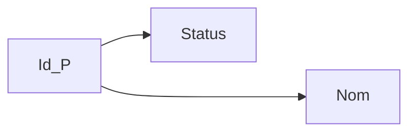
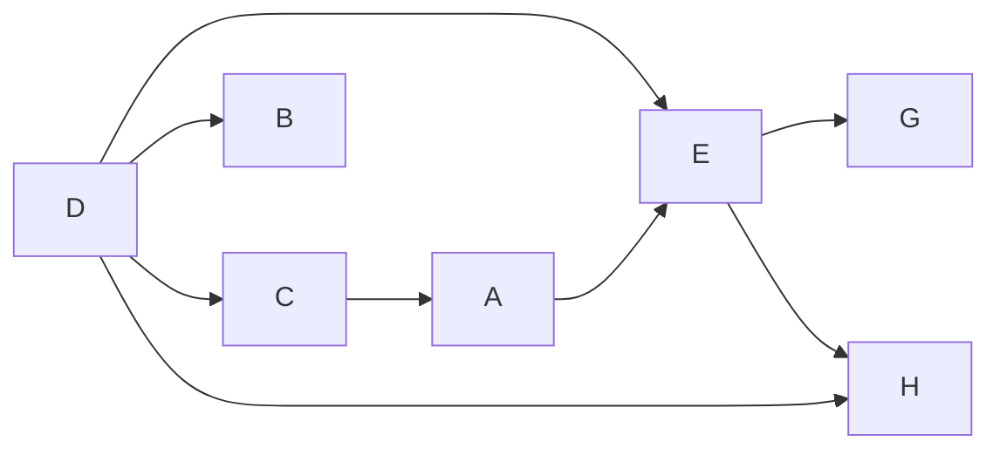
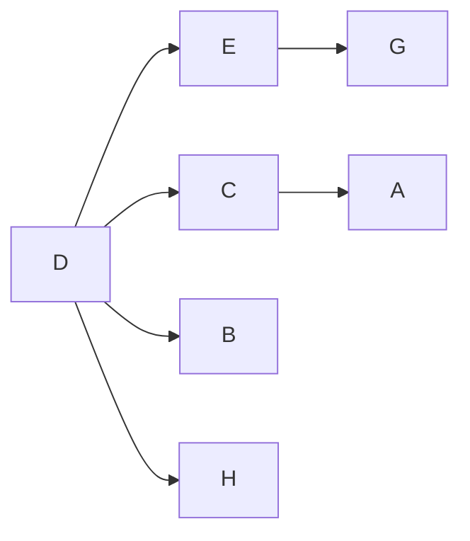
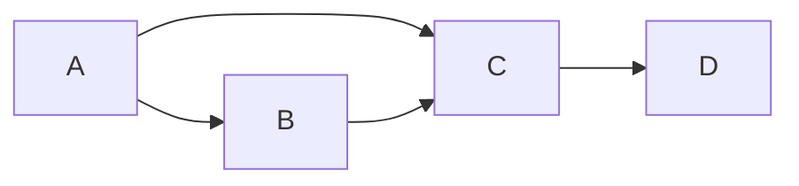
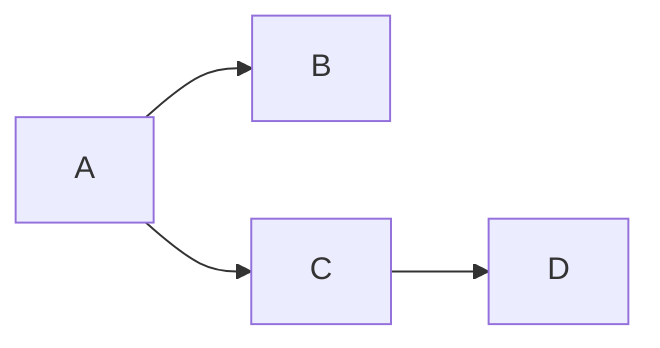
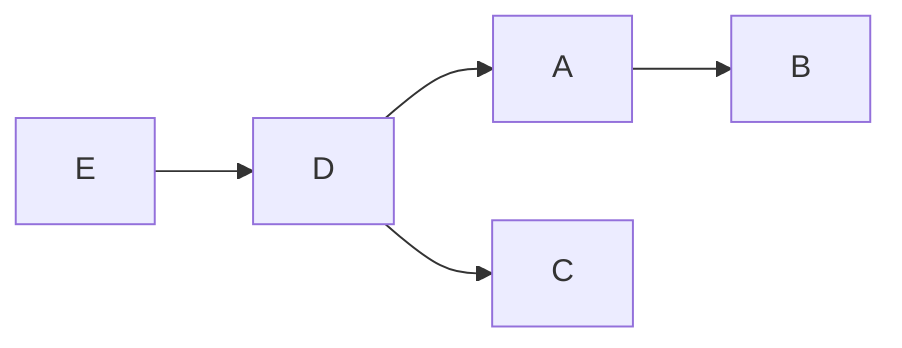
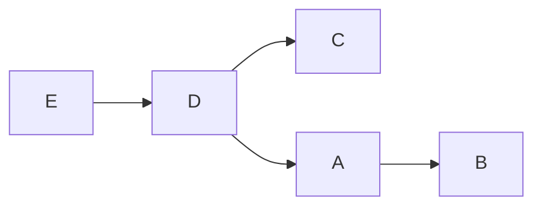
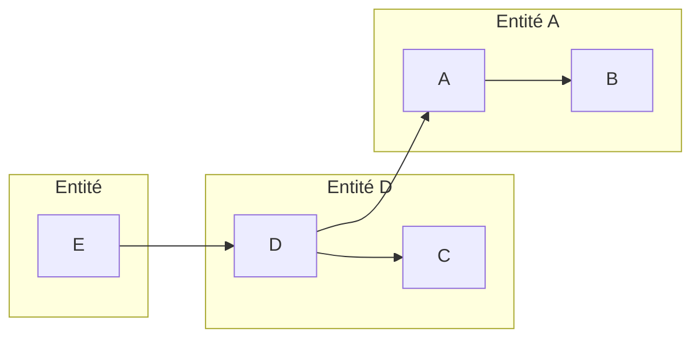
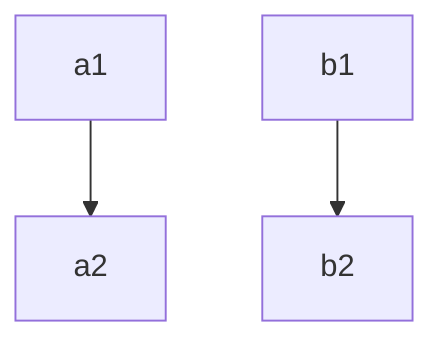
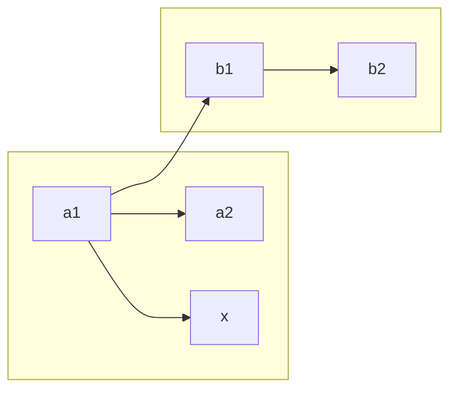

# SQL

## Groupe

```sql
SELECT * FROM <table_>
WHERE <condition>
GROUP BY <attributs>
HAVING <condition>
```

Exemple pilotes

```sql
SELECT IdPil
FROM Vol
GROUP BY IdPil
```

| Résultat | IdPil |
|----------|-------|
|          |   1   |
|          |   2   |
|          |   3   |

```sql
SELECT IdPil, COUNT(*) as nombre
FROM Vol
GROUP BY IdPil
```

| Résultat | IdPil | nombre |
|----------|-------|--------|
|          |   1   |    2   |
|          |   2   |    2   |
|          |   3   |    3   |

```sql
SELECT IdPil, COUNT(DISTINCT IdAv) as nombre
FROM Vol
GROUP BY IdPil
```

| Résultat | IdPil | nombre |
|----------|-------|--------|
|          |   1   |    2   |
|          |   2   |    1   |
|          |   3   |    2   |
### Avoir la liste de tout les pilote qui vole sur tout les avions avec `GROUPE BY`

```sql
SELECT IdPil
FROM Vol
GROUP BY IdPil
HAVING COUNT(DISTINCT IdAv) = (SELECT COUNT(*)
                               FROM Avion+)
```


## Gestion d'une base de donnée

### Création
```sql
CREATE { DATABASE | SCHEMA } <nom_base>
```

### Suppression

```sql
DROP { DATABASE | SCHEMA } <nom_base>
```

### Création de table
```sql
CREATE TABLE <nom table>
    (colonne1 nom_colonne contrainte_de_colonne)
    (colonne2 nom_colonne contrainte_de_colonne)
    (colonne3 nom_colonne contrainte_de_colonne)
```

### Suppression de table

```sql
DROP TABLE <nom table>
```

### Contrainte de colonne

* **NOT NULL** : valeur nulle impossible
* **DEFAULT** : valeur par défaut
* **PRIMARY KEY** : colonne considéré comme clé primaire
* **REFERENCES** table_ref : contrainte de référence sur une autre table
* **CHECK** condiiton_val : contrainte sur la valeur d'une colonne

### Contrainte sur une table

* **UNIQUE**
*

* ```sql
   FOREIGN KEY (liste_col)
   REFERENCES table_ref (colonnes_ref)
   [ON DELETE reference_option]
   [ON UPDATE reference_option]
  ```

reference_option:
```sql
RESTRICT | CASCADE | SET NULL | NO ACTION
```
* `RESTRICT`: aucun effet car la CI ne doit pas être brisée
* `RESTRICT`: en cas de suppresision d'un enregistrement, les enregistrements
qui les références sont eux ausso supprimés. Attention coût de traitement très élevé
* `SET NULL`: en cas de suppression d'un enregistrement, la clef étrangère est mis à NULL
* `NO ACTION`: ne fait rien

## Index

### Création d'un index

```sql
CREATE [UNIQUE] INDEX <nom>
```

### Suppression d'un index

```sql
DROP INDEX <nom>
```

## Trigger

* L'instruction `CHECK(<condition>)` sur un oou plusieurs attributs.
Portées limitée avec test à des instants précis : sur insertion ou mise à jour de l'enregistrement courant
* Les assertions qu'une application doit vérrifier sont souvent plus difficile à vérifier

```sql
CREATE ou REPLACE TRIGGER <event>
```

Exemple:
```sql
CREATE TRIGGER T_nouveaute
    AFTER INSERT ON Vendre
    FOR EACH ROW
        IF (new.nomP <> ALL (SELECT nomP FROM Produit))
            INSERT new INTO Produit
```

## Contrôle des données: les vues

Rôle d'une vue
* Préserver la confidentialité des données
* Augmenter l'indépendance logique

* Utilisation des des pour:
    - Interdire l'accès à certaines colonnes
    - Interdire l'accès à certaines données

Une vue est calculé lorsqu'elle est appellé dans la clause
FROM d'un requete

```sql
{ CREATE | REPLACE } VIEW <nom_vue> AS
{Instruction SELECT}
```

```sql
DROP VIEW <nom_vue>
```

## Priviliege

```sql
CREATE USER <user> [IDENTIFIED BY <password>]
```

```sql
GRANT {ALL PRIVILEGES | SELECT | INSERT | ... } ON [Relation entre objet] TO <liste d'utilisateur> [WITH GRANT OPTION];
```

```sql
REVOKE {ALL PRIVILEGES | SELECT | INSERT | ... } ON [Relation entre objet] FROM <liste d'utilisateur>;
```

## Propriété d'un SGBD : ACID
* **Atomicité**
* **Cohérence**: Préserver l'intégrité des données
* **Isolation**: Aucune action simultané ne doit interféré
* **Durabilité**

## Exemple TP

```sql
SELECT `prenomP` 
FROM `pilote` 
WHERE `villeP` = "Paris" 
AND prenomP <> "Jean";

SELECT `IdAvion` 
FROM `avion` 
WHERE `cap` > 250 
OR base = "Paris";

SELECT DISTINCT `IdPilote` 
FROM `vol` 
WHERE `IdAvion` = 2 
OR `IdAvion` = 3;

SELECT AVG(`cap`) 
FROM `avion`;

SELECT MAX(`cap`) 
FROM `avion`;

SELECT * 
FROM `pilote` 
JOIN `vol` ON `pilote`.`IdPilote` = `vol`.`IdPilote`;

SELECT `pilote`.`prenomP` 
FROM `pilote` 
JOIN `vol` 
ON `pilote`.`IdPilote` = `vol`.`IdPilote` 
AND `vol`.`villeD` = "Toulouse";

# Seulement les pilotes qui volent
SELECT `pilote`.`IdPilote`, `vol`.`IdAvion` 
FROM `vol` 
JOIN `pilote` ON `pilote`.`IdPilote` = `vol`.`IdPilote` 
ORDER BY `pilote`.`IdPilote`;

# Les pilote qui ne volent jamais
SELECT `pilote`.`IdPilote`, `vol`.`IdAvion` 
FROM `vol` 
RIGHT OUTER JOIN `pilote` ON `pilote`.`IdPilote` = `vol`.`IdPilote` 
ORDER BY `pilote`.`IdPilote`;

# Les avions ayant la plus grande capacité
SELECT DISTINCT `nomA` 
FROM `avion` 
WHERE `cap` = (SELECT MAX(`cap`) FROM `avion`);

# Insert un avion A380 en spécifiant un ID
INSERT INTO `avion` 
VALUES (5, "Airbus A380", 450, "Paris");

# Supprime l'avion d'id 5
DELETE FROM `avion` 
WHERE `IdAvion` = 5;

# Insert un nouvelle avion A380
INSERT INTO `avion` (`nomA`, `cap`, `base`) 
VALUES ("Airbus A380", 450, "Paris");

# Change la capacité des avions A380 à 550 places
UPDATE `avion` 
SET `cap` = 550
WHERE `nomA` = "Airbus A380";

# Supprime un les avions du model A380
DELETE FROM `avion` 
WHERE `nomA` = "Airbus A380";

# Pilote qui ne vole jamais
SELECT `pilote`.`prenomP` 
FROM `pilote` 
LEFT OUTER JOIN `vol` ON `vol`.`IdPilote` = `pilote`.`IdPilote` 
WHERE `vol`.`IdPilote` IS NULL;

# Pilote qui ne décolle jamais de Lyon
SELECT `pilote`.`prenomP`
FROM `pilote` 
LEFT OUTER JOIN `vol` ON `pilote`.`IdPilote` = `vol`.`IdPilote`AND `vol`.`villeD` = "Lyon"
WHERE `vol`.`villeD` IS NULL;

# Piltore qui vole sur les avions 2 ou/et 3
# OU
SELECT DISTINCT `pilote`.`prenomP`, `pilote`.`IdPilote` 
FROM `pilote` 
INNER JOIN `vol` ON `vol`.`IdPilote` = `pilote`.`IdPilote` 
WHERE `vol`.`IdAvion` IN (2,3);

# ET
SELECT DISTINCT `v1`.`IdPilote` 
FROM `vol` AS `v1`
INNER JOIN `vol` AS `v2` ON `v1`.`IdPilote` = `v2`.`IdPilote`
AND `v2`.`IdAvion` = 3
AND `v1`.`IdAvion` = 2;

# Pilote qui vole sur tout les avions
SELECT `IdPilote`
FROM (SELECT `IdPilote`, `IdAvion`
      FROM `vol`
      GROUP BY `IdPilote`,  `IdAvion`) T
GROUP BY `IdPilote`
HAVING COUNT(*) = (SELECT COUNT(*) FROM `avion`);

# Pilote qui ne vole jamais sur Airbus
SELECT `pilote`.`prenomP`
FROM (SELECT `vol`.`IdPilote`
      FROM `vol`
      NATURAL JOIN `avion`
      WHERE `avion`.`nomA` LIKE "Airbus%") `T`
RIGHT OUTER JOIN `pilote` USING(`IdPilote`)
WHERE `T`.`IdPilote` IS NULL;

# Pilote qui pilote tout les Airbus
SELECT `IdPilote`
FROM (SELECT `IdPilote`, `IdAvion`
      FROM `vol`
      NATURAL JOIN `avion`
      WHERE `avion`.`nomA` LIKE "Airbus%"
      GROUP BY `IdPilote`,  `IdAvion`) T
GROUP BY `IdPilote`
HAVING COUNT(*) = (SELECT COUNT(*) FROM `avion`
                   WHERE `nomA` LIKE "Airbus%");
                   
# Nom de l'avion qui vole le plus
CREATE VIEW NbVols AS
SELECT `IdAvion`, COUNT(*) AS `nbVol`
FROM `vol`
GROUP BY `IdAvion`;

SELECT `avion`.`nomA`
FROM `avion`
INNER JOIN `NbVols` ON USING(`IdAvion`)
AND `NbVols`.`nbVol` = (SELECT MAX(`nbVol`)
                        FROM `NbVols`);

# Tout les avions partant le 23 janvier 2012
SELECT COUNT(*)
FROM `vol`
WHERE DATE(`dateD`) = "2012-01-23";                        

# Séléctionner tout les pilote ayant eu au moins deux formation en 2012
SELECT `p`.`prenomP`, `p`.`IdPilote`
FROM `pilote` AS `p`
INNER JOIN `suivre` AS `s` 
ON `s`.`IdPilote` = `p`.`IdPilote`
AND YEAR(`s`.`dateF`) = "2012"
GROUP BY `s`.`idPilote`
HAVING COUNT(*) >= 2;

# Nombre de vols partant le 21 du mois (n'importe le quel)
SELECT COUNT(*)
FROM `vol`
WHERE DAY(`dateD`) = "21";

#  Quels sont les noms et id des pilotes qui n’ont jamais suivi de formation 
SELECT `pilote`.`prenomP`, `pilote`.`IdPilote`
FROM `pilote`
LEFT OUTER JOIN `suivre` ON `suivre`.`idPilote` = `pilote`.`IdPilote`
WHERE `suivre`.`IdPilote` IS NULL;

# Parmi les pilotes ayant déjà suivi au moins une formation, 
# indiquer pour chacun des pilotes le nom des formations suivies et la date de suivi la plus récente. 
SELECT `pilote`.`prenomP`, `formation`.`nomF`, MAX(`suivre`.`dateF`)
FROM `pilote`
INNER JOIN `suivre` ON `suivre`.`idPilote` = `pilote`.`IdPilote`
INNER JOIN `formation` ON `suivre`.`idForm` = `formation`.`idForm`
GROUP BY `suivre`.`idPilote`, `suivre`.`idForm`;

# Ajouter 8 ans à toutes les dates
UPDATE `suivre`
SET `dateF` = DATE_ADD(`dateF`, INTERVAL 8 YEAR);

# Indiquer les noms des pilotes et des formations suivies qui sont encore valides à ce jour 
SELECT `pilote`.`prenomP`, `formation`.`nomF`, MAX(`suivre`.`dateF`)
FROM `pilote`
INNER JOIN `suivre` ON `suivre`.`idPilote` = `pilote`.`IdPilote`
INNER JOIN `formation` ON `suivre`.`idForm` = `formation`.`idForm`
AND `formation`.`duree` + YEAR(`suivre`.`dateF`) >= YEAR(CURDATE())
GROUP BY `suivre`.`idPilote`, `suivre`.`idForm`;

# Indiquer les noms des pilotes et des formations suivies qui sont
# encore valides à ce jour et leur date de fin de validité.
SELECT `p`.`prenomP`, `f`.`nomF`, `s`.`dateF`, `f`.`duree`, 
DATE_ADD(`s`.`dateF`, INTERVAL `f`.`duree` YEAR) AS date_limit
FROM `pilote` AS `p`
INNER JOIN `suivre` AS `s` ON `s`.`idPilote` = `p`.`IdPilote`
INNER JOIN `formation` AS `f` ON `s`.`idForm` = `f`.`idForm`
AND `f`.`duree` + YEAR(`s`.`dateF`) >= YEAR(CURDATE())
GROUP BY `s`.`idPilote`, `s`.`idForm`;

# Affiche le nombre de jours moyen qui sépare le suivi d’une même formation par un pilote
SELECT `p`.`prenomP`, `f`.`nomF`, 
CEIL(DATEDIFF(MAX(`s`.`dateF`), MIN(`s`.`dateF`)) / COUNT(*)) AS nb_jour_moyen_entre_formation
FROM `pilote` AS `p`
INNER JOIN `suivre` AS `s` ON `p`.`IdPilote` = `s`.`idPilote`
INNER JOIN `formation` AS `f` ON `s`.`idForm` = `f`.`idForm`
GROUP BY `s`.`idPilote`, `s`.`idForm`
HAVING COUNT(*) >= 2;
```

# Mise en oeuvre d'un SGBD

## Principaux moteur de stockage

**Les deux principaux:**

* **InnoDB**: Moteur de table transactionnel
* **My ISAM**: Simple et rapide. Moteur qui ne gère pas les transactions

### InnoDB
* Moteur plus récent
* Gestion des clés étrangères
* Moteur transactionnel
* Plus lent en écriture que MyISAM
* Nécessite de faire des réglages pour bien l'utiliser (administration)
* Besoin de plus d'espace disque

### MyISAM
* Moteur historique de MySQL
* Rapide pour les requêtes de lecture et d'écriture (`SELECT`, `INSERT`)
* Ne gère pas les clés étrangères
* Seul à gérer les index « Fulltext »
* Facile à administrer
:::note
A utiliser si on veut juste séléctionner et inserer pas forcément de mise en relation
:::

### Les autres
* **MEMORY**
* **MERGE**
* **ARCHIVE**
* **CSV**

## Architecture PHP
### Architecture 3 Tiers
* Couche présentation
* Couche métier
* Couche accès aux données

#### Couche présentation
* Partie visible pa l'utilisateur

#### Couche metier
* Partie logique
* Application pour répondre à l'utilisation

#### Couche accès aux données
* Gère l'accès aux données (stockage, méthode d'accès), géré les outils MySQL

### Logiciels mettant en oeuvre

* **Apache**
* **PHP**
* **MySQL**

## Optimiseur de requêtes

L'optimiseur travaille en 2 phases:
* **Optimisation logique** : réécriture sous une forme canonique simplifiée e toptimisée, sans tenir compte des coûts d'accès aux données

* **Optimiseur physique**

### Différent type de requête
* **Requête statique**: écriture en dur dans le code éventuellement paramétrée par des variables.
    - Optimisée une seule fois lors de la compilation du programme.
    Ensuite requête très souvent executé
* **Requête dynamique**

### Étape d'analyse d'une requête
* Analyse syntaxique
* Mise sous forme canonique
* Arbre d'opération de l'AR : plusieurs arbres possibles
* Génération des plans d'éxecution.
* Optimisation des plans d'execution : calcul du coût de l'éxécution
d'une requête

#### Mise sous forme canonique
* Commutativité des jointures
* Associativité des jointures
* Fusion des projections
* Regroupement des sélections

# Normalisation du MLD

## Dépendance fonctionnelles et formes normales

### Axiomes de Armstrong
#### Réfléxivité
$Y \subseteq X \Rightarrow X \rightarrow Y$

#### Augmentation
$X \rightarrow Y \Rightarrow XZ \rightarrow YZ$

#### Transitivité
$X \rightarrow Y$ et $Y \rightarrow Z \Rightarrow X \rightarrow Z$

### Graphe de dépendances fonctionnelle

Nœuds = Attributs <br/>
Axes = $DF$



### Fermeture d'un ensemble de dépendance fonctionnelle $F$
Notation $F^+$
Ensemble de <u>toutes</u> les dépendances fonctionelles déductibles de F par les axiomes de armstrong

### Couverture minimal de dépendance fonctionnelle $F$
Notation $G$ <br/>
$G$ est un sous ensemble minimum de $DF$ élémentaires permetant de générer toutes les autres. <br/>
$G^+ = F^+$
Toutes dépendance fonctionelles G est cannonique.

#### Exemple

Graphe $DF$



$AD \rightarrow E \Rightarrow D \rightarrow E$
* preuve
    $D \rightarrow C \rightarrow A \Rightarrow D \rightarrow A$

Graphe $DF$ élémentaire


### Formes normales

#### Première forme forme normale (1FN)

On dit qu'une relation est en 1FN si :
* tous les attributs qui la coomposent sont atomiques

#### Deuxième forme normale (2FN)
On dir qu'une relation est en 2FN si :
* Elle est en 1FN
* Toutes les DFs entre la clé et les autres attributs sont élémentaires.
i.e tout attribut non clé primaire est dépendant de la
totalité de la clé primaire.

#### Troisième forme normale (3FN)
On dir qu'une relation est en 3FN si :
* Elle est en 2FN
* Toutes les DFs entre clef et autres attributs sont **élémentaire** et **directe**
i.e. tout attribut non clé ne dépend pas d'un
attribut non clé.

#### Frome normale de Boyce-Codd
On dit qu'une relation est en FNBC si :
* elle est en 3FN
* tout attribut non clé ne doit pas déterminer une 
partie de la clé

#### Exemple de forme normale

##### Ex 1
$R(A, B, C, D)$<br/>
$\mathcal{F} = \{A \rightarrow B; AB \rightarrow C; C \rightarrow D\}$

###### 1ièr étape : graphe de DF



###### 2ième étape : recherche de la couverture minimale de $\mathcal{F}$

$AB \rightarrow C$ non élémentaire car $A \rightarrow C$

$A \rightarrow B \Rightarrow A \rightarrow AB$
et $AB \rightarrow C \Rightarrow A \rightarrow C$



Couverture minimale = $\{A \rightarrow C, A \rightarrow B, C \rightarrow D\}$

###### 3ième étape : recherche de la clé de $R(\underline{A}, B, C, D)$

###### 4ième étape de R ?

* 1FN : OK
* 2FN OK 
* 3 FN : Non 

##### Ex 2
$R(A, B, C, D, E)$<br/>
$\mathcal{F} = \{A \rightarrow B; D \rightarrow C; D \rightarrow A; E \rightarrow D\}$

###### 1ièr étape : graphe de DF



###### 2ième étape : recherche de la couverture minimale de $\mathcal{F}$

$\mathcal{F}$ est une couverture minamale$


###### 3ième étape : recherche de la clé de $R(\underline{E}, A, B, C, D)$

###### 4ième étape de R ?

* 1FN : OK
* 2FN OK
* 3 FN : Non car DF entre attibuts non clé

##### Ex 3


**<u>MLD normalisé</u>** : « approche graphique »

$R_1(\underline{A}, B)$ 3FN <br/>
$R_2(\underline{D}, A, C)$ 3FN <br/>
$R_3(\underline{E}, D)$ 3FN

### La démarche d’analyse E/A
#### Étape 1 - Constituer le dictionnaire des données :
* Établir la liste des propriétés à partir de tous les documents et
fichiers.
* Proposer des identifiants pour les « entités évidentes »
* Utiliser des noms distincts pour des utilisations différentes
(date_Fac et date_Com)
* Eliminer les synonymes : Id_client et code client
* Eliminer les polysémies : Qte pour Qte_Commandee et
Qte_Facturee

#### Étape 2 - Graphe des dépendances fonctionnelles
* Travailler à partir des propriétés du Dictionnaire des données qui
ne sont <u>ni calculées</u>, <u>ni composées (concaténées)</u>.
* Etablir le graphe des Df à partir des règles de gestion du système
d’information modélisé.
* Rechercher sa couverture minimale.

#### Étape 3 - Analyse graphique du graphe de la
couverture minimale :
* Les arcs terminaux obtenus à partir d’une propriété mono-
attribut définissent **les entités**. La partie gauche mono-attribut
est l’identifiant.
* Les arcs restants seront **les associations**. Les propriétés non
isolées restantes sont affectées à ces associations.
* Les propriétés isolées sont des entités isolées.


### Synthèse des différentes méthode d'analyse



MCD sans cardinalité = **0**



$R_3(\underline{\#a_1, \#b_1}, x)$<br/>
$R_A(\underline{a_1}, a_2)$<br/>
$R_B(\underline{b_1}, b_2)$

```sql
START TRANSACTION;

SELECT salary 
FROM salaries
NATURAL JOIN employees
WHERE emp_no = 10002;

DELETE FROM employees
WHERE emp_no = 10002;

SELECT salary 
FROM salaries
NATURAL JOIN employees
WHERE emp_no = 10002;

ROLLBACK;

SELECT salary 
FROM salaries
NATURAL JOIN employees
WHERE emp_no = 10002;


# Ex 3
# Tout les titres de post
SELECT DISTINCT `title` FROM `titles`; 

# Tout les employées en poste le 10 février 2025
SELECT `e`.`first_name`, `e`.`last_name`, `t`.`title`
FROM `employees` AS e
NATURAL JOIN `titles` AS t
WHERE `e`.`hire_date` <= "1985-02-10";

# Lister les informations sur les employés qui ont déjà tenu 3 fonctions (title) différentes. Trier les résultats par ordre chronologique des fonctions tenues par chaque employé.
SELECT `e`.*
FROM `employees` AS `e`
NATURAL JOIN `titles` AS `t`
GROUP BY `t`.`title`
HAVING COUNT(*) >= 3
ORDER BY `t`.`from_date`;

# Quels sont les employés qui ont obtenu plus de 10% d’augmentation en moins d’un an ?
SELECT DISTINCT `e`.`first_name`, `e`.`last_name`
FROM `employees` AS `e`
NATURAL JOIN `salaries` AS `s1`
INNER JOIN `salaries` AS `s2` ON `s2`.`emp_no` = `s1`.`emp_no`
AND `s1`.`from_date` < `s2`.`from_date`
AND DATEDIFF(`s2`.`from_date`, `s1`.`from_date`) < 365
WHERE `s1`.`salary` * 1.1 < `s2`.`salary`;


CREATE VIEW manager AS
SELECT `e`.`emp_no`, `e`.`first_name`, `e`.`last_name`, `d`.`from_date`, `d`.`to_date`
FROM `employees` AS `e`
NATURAL JOIN `dept_manager` AS `d`;

select `employees`.`dept_manager`.`from_date` AS `debut`,`employees`.`dept_manager`.`to_date` AS `fin` from ((`employees`.`departments` join `employees`.`dept_manager` on(`employees`.`departments`.`dept_no` = `employees`.`dept_manager`.`dept_no`)) join `employees`.`employees` on(`employees`.`dept_manager`.`emp_no` = `employees`.`employees`.`emp_no`)) where `employees`.`employees`.`first_name` = 'Xiaobin' and `employees`.`employees`.`last_name` = 'Spinelli' and `employees`.`departments`.`dept_name` = 'Customer Service'

SELECT first_name, last_name, from_date, to_date
FROM departments
NATURAL JOIN dept_emp
NATURAL JOIN employees, periode
WHERE dept_name = "Customer Service" AND (to_date >= debut) AND (from_date <= fin);


# Affichez pour chacun des responsables de département qui sont actuellement en exercice :
son nom, prénom, le salaire minimum et le salaire maximum qu’il a pu avoir.
SELECT employees.first_name, employees.last_name, MIN(salaries.salary), MAX(salaries.salary)
FROM employees
INNER JOIN dept_manager ON employees.emp_no = dept_manager.emp_no 
AND to_date > CURRENT_DATE()
INNER JOIN salaries ON employees.emp_no = salaries.emp_no
GROUP BY employees.emp_no;
```
